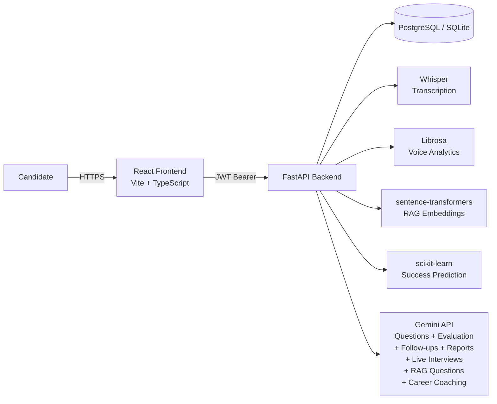

# AI Interview Intelligence Platform


A full-stack platform for AI-assisted mock interview practice. Candidates
create an interview session for a target job role, receive AI-generated
interview questions, record audio answers, and get back an automatic
transcript plus an AI evaluation across five scoring dimensions with
concrete strengths, weaknesses, and feedback. The platform also features
a live conversational AI interviewer, resume-aware RAG question generation,
ML-powered success prediction, percentile benchmarking, and an AI career
coach that generates 7/14/30-day improvement plans.

---

## Project Overview

The platform combines:

- **Question generation** — Google Gemini generates role-specific interview
  questions from a job title and description.
- **Audio response capture** — candidates upload a recorded answer per
  question.
- **Local transcription** — OpenAI Whisper (CPU) transcribes the audio
  on the server, with no external API call required.
- **AI evaluation** — Gemini scores each transcript on communication,
  technical depth, problem solving, and confidence, plus an overall score
  and written feedback.
- **Asynchronous processing UI** — the frontend polls a processing-status
  endpoint and renders the transcript and analysis as soon as they're ready.

Built as a portfolio-quality, production-shaped project: JWT auth with
per-user data isolation, Alembic-migrated PostgreSQL schema, hardened CORS,
structured logging, a Dockerized backend, and a documented Render deployment
path.

---

## Features

**Authentication & Security**
- Email/password registration and login (JWT bearer tokens)
- Per-user ownership enforcement on every resource (other users' data
  returns `404`, never `403`, to avoid leaking existence)
- Environment-driven CORS allowlist (no wildcard origins)

**Interview Sessions**
- Create, list, update, and delete interview sessions (title, job role, job
  description)
- Session status lifecycle: `draft → in_progress → processing → completed`

**AI Question Generation**
- Generate role-specific interview questions via Gemini, categorized and
  ordered

**Audio Upload & Processing**
- Multipart audio upload per question, with file-size and content-type
  validation
- Background processing pipeline: Whisper transcription → Gemini evaluation
- Per-response status tracking (`uploaded → processing → completed/failed`)
  with stuck-job recovery on startup

**Transcript & Analysis**
- Full transcript with detected language, word count, and duration
- Five AI-generated scores (overall, communication, technical, problem
  solving, confidence) plus strengths, weaknesses, and detailed feedback

**Voice Analytics Engine** *(Phase 16)*
- Librosa-based audio analysis pipeline: speaking rate (WPM), pause detection,
  filler word counting (um/uh/like/you know/actually/basically), RMS energy
  consistency, and a composite confidence score (0–100)
- Runs as a best-effort step after Whisper — failures never abort the pipeline

**AI Follow-Up Interviewer** *(Phase 16)*
- Gemini generates targeted follow-up questions from a candidate's answer
- `POST /interviews/{id}/follow-up-question` + `GET /interviews/{id}/conversation-history`

**Analytics Dashboard** *(Phase 16)*
- Score-trend Recharts line chart across sessions (overall, communication,
  technical, problem solving)
- Stat cards: total sessions, avg score, strongest/weakest skill, improvement delta

**Session-Level Final Report** *(Phase 16)*
- Gemini-generated holistic report: overall performance narrative, category
  breakdown, strengths/weaknesses bullets, improvement plan, readiness level
  (Beginner → Highly Competitive)
- `POST /interviews/{id}/report/generate` + `GET /interviews/{id}/report`

**Live Conversational AI Interviewer** *(Phase 17)*
- Multi-turn, context-aware AI interview: Gemini generates follow-up questions
  that build on prior answers and increase in difficulty (warm-up → advanced)
- `POST /live-interviews/` (start + first question) · `POST /{id}/next-question`
  · `GET /{id}/conversation` · `POST /{id}/end` (summary generation)
- Frontend: `LiveInterviewPage` with progress bar, difficulty badges, and
  collapsible conversation history

**Resume + Job Description RAG System** *(Phase 18)*
- Upload PDF/DOCX resumes — text extracted, chunked (200-word overlapping
  windows), and embedded via sentence-transformers (all-MiniLM-L6-v2)
- Embeddings stored as JSON in SQLite/PostgreSQL (no pgvector required)
- `POST /documents/resume/upload` · `GET /documents/resume/current`
- `POST /documents/interviews/{id}/generate-rag-questions` — top-k cosine
  similarity retrieval drives personalised Gemini question generation

**Interview Benchmarking & Predictive Analytics** *(Phase 19)*
- Logistic regression trained on 2000 synthetic samples at startup — predicts
  success probability and outcome (Strong Pass / Pass / Borderline / Fail)
- Percentile ranking: user's avg score compared to all platform users
- `POST /interviews/{id}/predict` · `GET /analytics/benchmarks`
- Dashboard: RadarChart skill-breakdown + benchmark stat cards

**AI Career Coach** *(Phase 19)*
- Gemini-generated 7/14/30-day personalised improvement plans using session
  metrics, readiness level, and identified weaknesses
- `POST /interviews/{id}/coaching-plan` · `GET /interviews/{id}/coaching-plan`

**Frontend**
- React + TypeScript SPA: auth pages, session list/detail, question/upload
  flow, analytics dashboard (`/dashboard`), live interview (`/live-interview`)
- Live processing-status polling (3s interval, stops on terminal state)
- VoiceAnalyticsCard per response with confidence badge and metric grid
- Dashboard: LineChart score trends + RadarChart skill breakdown + benchmark percentile
- Generic, user-friendly error handling — raw API errors are never shown

---

## Architecture



This is a high-level view. The full request flow and the audio processing
pipeline (with status transitions) are diagrammed in
[docs/architecture.md](docs/architecture.md).

---

## Tech Stack

| Layer | Technologies |
|---|---|
| **Backend** | FastAPI, SQLAlchemy 2.x, Alembic, Pydantic v2 / pydantic-settings, python-jose (JWT), bcrypt, Uvicorn |
| **AI / ML** | Google Gemini (`google-genai`) for question generation, evaluation, follow-ups, session reports, live interviews, RAG questions & career coaching; OpenAI Whisper + PyTorch (CPU) for transcription; librosa for voice analytics; sentence-transformers (all-MiniLM-L6-v2) for RAG embeddings; scikit-learn logistic regression for success prediction |
| **Database** | PostgreSQL 16 (SQLite for the test suite) |
| **Frontend** | React 19, TypeScript, Vite, React Router v6, Recharts (LineChart + RadarChart) |
| **Testing** | pytest + httpx (backend, 170 tests), Vitest + React Testing Library (frontend, 31 tests) |
| **Infrastructure** | Docker, Docker Compose (local), Render (Web Service + Static Site + managed PostgreSQL) |

---

## Screenshots

> Screenshots are not yet committed. See
> [docs/screenshots.md](docs/screenshots.md) for the exact list of captures
> needed, their filenames, and where they belong in this README.

| # | View | File |
|---|---|---|
| 1 | Login page | `docs/screenshots/01-login.png` |
| 2 | Registration page | `docs/screenshots/02-register.png` |
| 3 | Session list | `docs/screenshots/03-session-list.png` |
| 4 | Session details | `docs/screenshots/04-session-detail.png` |
| 5 | Generated questions | `docs/screenshots/05-questions.png` |
| 6 | Audio upload | `docs/screenshots/06-upload.png` |
| 7 | Processing state | `docs/screenshots/07-processing.png` |
| 8 | Transcript view | `docs/screenshots/08-transcript.png` |
| 9 | Analysis view | `docs/screenshots/09-analysis.png` |

---

## System Design

- **Ownership model**: every query for a session/question/response/transcript
  /analysis is scoped to `WHERE user_id = current_user.id` (via the owning
  session). A resource that exists but belongs to another user returns `404`,
  identical to a resource that doesn't exist — this prevents enumeration.
- **Processing pipeline**: an audio upload creates an `AudioResponse` with
  status `uploaded`. A background task transitions it to `processing`, runs
  Whisper transcription (bounded by `WHISPER_TIMEOUT_SECONDS`), then Gemini
  evaluation (transcript truncated to `MAX_TRANSCRIPT_CHARS`), and finally
  `completed` or `failed` (with a generic error surfaced to the client — raw
  exception text is never returned). On startup, any response stuck in
  `processing` (e.g. from a crash) is recovered back to `failed`.
- **Polling, not websockets**: the frontend polls
  `GET /responses/{id}/processing-status` every 3 seconds and stops once a
  terminal state (`completed`/`failed`) is reached — simple, stateless, and
  proxy/CDN-friendly.
- **CORS**: `allow_origins` is driven entirely by the `CORS_ORIGINS` env var
  (comma-separated exact origins). `allow_credentials` is only enabled when
  at least one origin is configured — an unconfigured deployment fails closed
  rather than falling back to a wildcard.

---

## API Overview

All routes except `/health`, `/api/v1/auth/register`, and
`/api/v1/auth/login` require `Authorization: Bearer <token>`.

| Method | Path | Description |
|---|---|---|
| `GET` | `/health` | Liveness check (no DB access) |
| `POST` | `/api/v1/auth/register` | Create a new user |
| `POST` | `/api/v1/auth/login` | Exchange email + password for a JWT |
| `GET` | `/api/v1/auth/me` | Get the current authenticated user |
| `POST` | `/api/v1/interviews/` | Create an interview session |
| `GET` | `/api/v1/interviews/` | List the current user's sessions |
| `GET` | `/api/v1/interviews/{session_id}` | Get a session and its questions |
| `PATCH` | `/api/v1/interviews/{session_id}` | Update a draft session |
| `DELETE` | `/api/v1/interviews/{session_id}` | Delete a session |
| `POST` | `/api/v1/interviews/{session_id}/questions/generate` | Generate questions via Gemini |
| `GET` | `/api/v1/interviews/{session_id}/questions` | List a session's questions |
| `POST` | `/api/v1/interviews/{session_id}/responses` | Upload an audio response (multipart) |
| `GET` | `/api/v1/interviews/{session_id}/responses` | List audio responses for a session |
| `GET` | `/api/v1/responses/{response_id}/status` | Get a response's status |
| `POST` | `/api/v1/responses/{response_id}/process` | Trigger background processing |
| `GET` | `/api/v1/responses/{response_id}/processing-status` | Poll processing status (used by the UI) |
| `GET` | `/api/v1/responses/{response_id}/transcript` | Get the Whisper transcript |
| `GET` | `/api/v1/responses/{response_id}/analysis` | Get the Gemini evaluation |

Interactive docs (`/docs`, `/redoc`) are available when `DEBUG=true` and
disabled in production.

---

## Local Setup

### Backend

```bash
cd backend
python -m venv .venv
source .venv/bin/activate          # Windows: .venv\Scripts\activate
pip install -r requirements.txt

cp ../.env.example ../.env         # fill in DATABASE_URL, JWT_SECRET_KEY, GEMINI_API_KEY
alembic upgrade head
uvicorn app.main:app --reload
```

API available at `http://localhost:8000` (`/docs` when `DEBUG=true`).

### Frontend

```bash
cd frontend
npm install
cp .env.example .env               # VITE_API_BASE_URL=http://localhost:8000
npm run dev
```

App available at `http://localhost:5173`.

### Tests

```bash
# Backend (94 tests)
cd backend && pytest

# Frontend (14 tests)
cd frontend && npm run test
```

---

## Docker Setup

```bash
cp .env.example .env               # fill in secrets
docker-compose up --build
docker-compose exec backend alembic upgrade head   # first run only
```

This starts PostgreSQL and the FastAPI backend (`http://localhost:8000`)
with live-reload and a bind-mounted source tree. See
[docs/DEPLOYMENT.md](docs/DEPLOYMENT.md) for the migration and persistent
storage strategy used in production.

---

## Render Deployment

The backend (Docker Web Service + managed PostgreSQL + persistent Disk) and
frontend (Static Site) are deployable to [Render](https://render.com) with
no code changes beyond what's already in this repo. Full step-by-step
instructions — including environment variables, the Alembic pre-deploy
command, the SPA rewrite rule, and a troubleshooting guide — are in
[docs/RENDER_DEPLOYMENT.md](docs/RENDER_DEPLOYMENT.md).

---

## Future Improvements

- In-browser audio recording (`MediaRecorder`) instead of file upload only
- Emotion/sentiment signals from audio (tone, pace) alongside transcript
  analysis
- Object storage (S3/R2) for uploaded audio instead of a local Disk, enabling
  horizontal scaling
- A job queue (e.g. Celery/RQ) for the processing pipeline instead of
  in-process background tasks
- CI pipeline (lint, type-check, test) on every push/PR
- Session-level summary report aggregating all question scores

---

## License

Released under the [MIT License](LICENSE).
