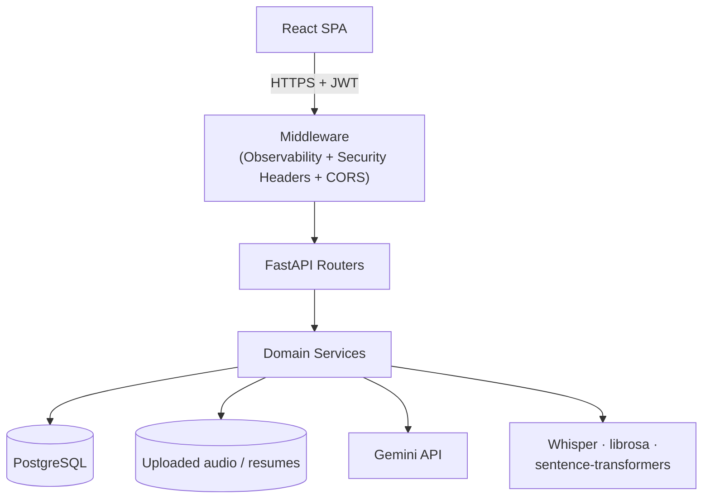
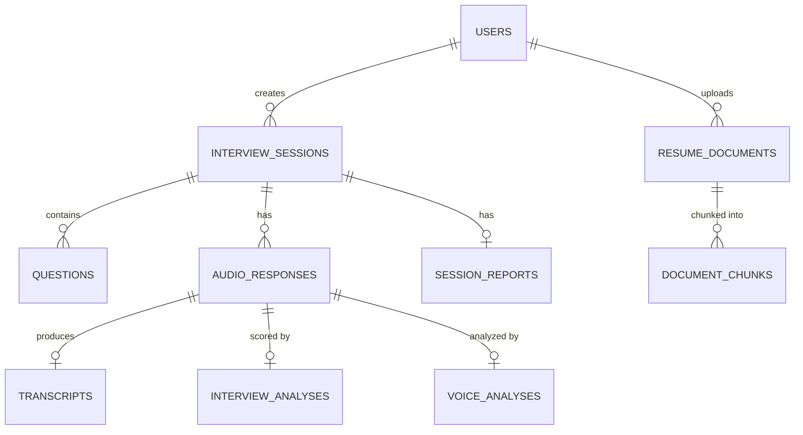

<div align="center">

# AI Interview Intelligence Platform

**AI-powered mock interview practice: question generation, audio transcription,
multi-dimensional evaluation, voice analytics, live conversational interviews,
resume-aware RAG questions, a transparent interview readiness score, and AI
career coaching.**

[](https://github.com/KeerthanaPothula/ai-interview-intelligence-platform/actions/workflows/ci.yml)
[](https://github.com/KeerthanaPothula/ai-interview-intelligence-platform/actions/workflows/security.yml)


</div>

---

## Table of contents

- [Overview](#overview)
- [Features](#features)
- [Architecture](#architecture)
- [Tech stack](#tech-stack)
- [Database](#database)
- [API](#api)
- [Local setup](#local-setup)
- [Deployment](#deployment)
- [Testing](#testing)
- [CI/CD](#cicd)
- [Monitoring & observability](#monitoring--observability)
- [Security](#security)
- [Screenshots](#screenshots)
- [Documentation](#documentation)
- [Roadmap](#roadmap)
- [License](#license)

---

## Overview

Candidates create an interview session for a target job role, get
AI-generated interview questions, record audio answers, and receive an
automatic transcript plus a five-dimension AI evaluation with concrete
strengths, weaknesses, and feedback. Beyond the core loop, the platform adds
a live conversational AI interviewer, resume-aware RAG question generation,
a transparent, weighted-average **Interview Readiness Score** with percentile
benchmarking (a documented formula, not a machine-learned prediction of
hiring outcomes — see [docs/AI_PIPELINE.md §9](docs/AI_PIPELINE.md#9-interview-readiness-scoring--benchmarking-prediction_servicepy-benchmark_servicepy)),
and an AI career coach that produces 7/14/30-day improvement plans.

Built as a portfolio-quality, production-shaped project: JWT auth with
refresh-token rotation and per-user data isolation, an Alembic-migrated
PostgreSQL schema, hardened CORS and security headers, structured JSON
logging with Prometheus metrics and optional OpenTelemetry tracing, a
hardened multi-stage Docker build, and a green GitHub Actions CI/CD
pipeline.

## Features

### AI Features
- Gemini-powered question generation, categorized (behavioral / technical /
  situational) and ordered
- Shared retry/backoff + JSON-repair reliability layer
  (`app/core/ai_reliability.py`) used by every Gemini call site

### Interview System
- Create, list, update, and delete interview sessions
- Session lifecycle: `draft → in_progress → processing → completed`
- Per-response status tracking (`uploaded → processing → completed/failed`)
  with atomic claiming and startup recovery for crashed jobs
- **Live Conversational AI Interviewer** — multi-turn, context-aware
  interview where each question builds on prior answers and increases in
  difficulty
- AI-generated follow-up questions targeting vague or interesting parts of
  an answer

### Resume Intelligence
- Upload PDF/DOCX resumes — text extracted, chunked (200-word overlapping
  windows), embedded via sentence-transformers (`all-MiniLM-L6-v2`)
- Cosine-similarity retrieval over a candidate's own resume chunks drives
  personalized, resume-grounded Gemini question generation (RAG)

### Voice Analytics
- Librosa-based acoustic analysis: speaking rate (WPM), pause detection,
  filler-word counting, RMS energy consistency, and a composite confidence
  score (0–100)
- Runs as a best-effort enrichment step — a failure here never blocks the
  transcript/evaluation pipeline

### Career Coaching
- Gemini-generated 7/14/30-day personalized improvement plans, grounded in
  a session's scores, readiness level, and identified weaknesses
- **Interview Readiness Score** — a transparent, documented weighted average
  of a session's own scores (`Excellent` / `Strong` / `Developing` /
  `Needs Improvement`), plus percentile benchmarking against all platform
  users. This is a deterministic formula, not a trained ML model — it does
  not predict real-world interview or hiring outcomes. Exact weights:
  [docs/AI_PIPELINE.md §9](docs/AI_PIPELINE.md#9-interview-readiness-scoring--benchmarking-prediction_servicepy-benchmark_servicepy)

### Dashboard & Analytics
- Score-trend line chart and skill-breakdown radar chart across sessions
- Holistic, Gemini-generated session reports: performance narrative,
  strengths/weaknesses, improvement plan, readiness level

### Security
- bcrypt password hashing, JWT access tokens with an instant-revocation
  `token_version` claim, SHA-256-hashed rotating refresh tokens
- Per-IP login rate limiting + progressive-backoff account lockout
- Layered file-upload validation (MIME allow-list, size limit, magic-byte
  signature check, filename sanitization)
- Security headers (CSP, X-Frame-Options, HSTS in production, etc.) on
  every response
- See [SECURITY.md](SECURITY.md) for full detail and accepted trade-offs

### Infrastructure
- Multi-stage, non-root Docker build; Docker Compose for local dev
- Alembic-migrated PostgreSQL (SQLite for tests), pre-deploy migration
  strategy, persistent storage strategy for uploaded audio

### DevOps
- GitHub Actions CI (lint, test + coverage, build, Docker validation) and a
  separate security workflow (`pip-audit`, `npm audit`, CodeQL)
- Structured JSON logging, Prometheus metrics, optional OpenTelemetry
  tracing, `/health` + `/ready` endpoints

## Architecture



This is the condensed view. Full system architecture, request-flow,
authentication-flow, interview-workflow, and deployment diagrams (all
Mermaid) are in **[docs/ARCHITECTURE.md](docs/ARCHITECTURE.md)**; the
step-by-step AI pipelines (Whisper, Gemini evaluation, voice analytics,
RAG, live interviews, readiness scoring, coaching) are in
**[docs/AI_PIPELINE.md](docs/AI_PIPELINE.md)**.

## Tech stack

### Backend

| Technology | Purpose |
|---|---|
| FastAPI | Web framework |
| SQLAlchemy 2.x | ORM |
| Alembic | Database migrations |
| Pydantic v2 / pydantic-settings | Schemas + typed, validated settings |
| python-jose | JWT signing/verification |
| bcrypt | Password hashing |
| Uvicorn | ASGI server |

### Frontend

| Technology | Purpose |
|---|---|
| React 19 | UI |
| TypeScript | Type safety |
| Vite | Build tool / dev server |
| React Router v6 | Routing |
| Recharts | Score-trend line chart + skill radar chart |

### AI/ML

| Technology | Purpose |
|---|---|
| Google Gemini (`google-genai`) | Questions, evaluation, follow-ups, live interviews, RAG questions, reports, coaching |
| OpenAI Whisper + PyTorch (CPU) | Audio transcription |
| librosa | Voice/acoustic analytics |
| sentence-transformers (`all-MiniLM-L6-v2`) | Resume/RAG embeddings |

### Database

| Technology | Purpose |
|---|---|
| PostgreSQL 16 | Production / Docker Compose |
| SQLite (in-memory) | Test suite |

### DevOps

| Technology | Purpose |
|---|---|
| Docker (multi-stage, non-root) | Backend image |
| Docker Compose | Local dev (backend + PostgreSQL) |
| GitHub Actions | CI/CD (`ci.yml`, `security.yml`) |
| Prometheus / OpenTelemetry | Metrics / tracing |

### Deployment

| Platform | Role |
|---|---|
| Render | Backend (Docker Web Service + Disk) + managed PostgreSQL + Static Site |
| Railway | Alternative backend host (Docker + Volume + PostgreSQL plugin) |
| Vercel | Alternative frontend static host |

### Testing

| Technology | Purpose |
|---|---|
| pytest + httpx | Backend (251 tests) |
| Vitest + React Testing Library | Frontend (31 tests) |
| Playwright | End-to-end (1 full-flow spec, local only — requires real Gemini key) |

## Database

16 tables, every row traceable to a `users.id` owner, UUID primary keys
generated in application code, cascading deletes on session/user removal.



Full entity-relationship diagram (all 16 tables with complete attribute
lists, cascade behavior, and the 7-revision migration history) is in
**[docs/DATABASE.md](docs/DATABASE.md)**.

## API

27 endpoints across health/observability, auth, interview sessions,
audio responses, processing, follow-ups, session reports, live
conversational interviews, resume/RAG, and readiness scoring/coaching.
All routes except `/health`, `/ready`, `/metrics`, and the auth
register/login/refresh endpoints require `Authorization: Bearer <token>`.
Interactive docs (`/docs`, `/redoc`) are available whenever `DEBUG=true`.

| Method | Path | Description |
|---|---|---|
| `GET` | `/health` | Liveness check (no DB access) |
| `GET` | `/ready` | Readiness check (DB + AI config) |
| `GET` | `/metrics` | Prometheus metrics |
| `POST` | `/api/v1/auth/register` | Create a user |
| `POST` | `/api/v1/auth/login` | Exchange credentials for access + refresh tokens |
| `POST` | `/api/v1/auth/refresh` | Rotate a refresh token for a new token pair |
| `GET` | `/api/v1/auth/me` | Get the current user |
| `POST` | `/api/v1/interviews/` | Create an interview session |
| `POST` | `/api/v1/interviews/{id}/questions/generate` | Generate questions via Gemini |
| `POST` | `/api/v1/interviews/{session_id}/responses` | Upload an audio response (multipart) |
| `GET` | `/api/v1/responses/{id}/processing-status` | Poll processing status (used by the UI) |
| `GET` | `/api/v1/responses/{id}/transcript` | Get the Whisper transcript |
| `GET` | `/api/v1/responses/{id}/analysis` | Get the Gemini evaluation |
| `POST` | `/api/v1/live-interviews/` | Start a live conversational interview |
| `POST` | `/api/v1/documents/resume/upload` | Upload a resume for RAG |
| `POST` | `/api/v1/interviews/{id}/readiness` | Compute the interview readiness score |
| `POST` | `/api/v1/interviews/{id}/coaching-plan` | Generate a career coaching plan |

Every endpoint — including full request/response JSON examples and error
codes — is documented in **[docs/API.md](docs/API.md)**.

## Local setup

### Docker (recommended)

```bash
cp .env.example .env   # fill in JWT_SECRET_KEY and GEMINI_API_KEY
docker-compose up --build
docker-compose exec backend alembic upgrade head   # first run only
```

Backend at `http://localhost:8000`.

### Without Docker

```bash
# Backend
cd backend
python -m venv .venv && source .venv/bin/activate   # Windows: .venv\Scripts\activate
pip install -r requirements.txt
cp ../.env.example ../.env
alembic upgrade head
uvicorn app.main:app --reload

# Frontend (separate terminal)
cd frontend
npm install
cp .env.example .env   # VITE_API_BASE_URL=http://localhost:8000
npm run dev
```

Frontend at `http://localhost:5173`. Full setup, every environment
variable, common commands, a debugging guide, and the migration workflow
are in **[docs/DEVELOPMENT.md](docs/DEVELOPMENT.md)**.

## Deployment

The backend is a single Docker image deployable to **Render** (documented
in full at [docs/RENDER_DEPLOYMENT.md](docs/RENDER_DEPLOYMENT.md)) or
**Railway**; the frontend is a static Vite build deployable to Render
Static Site or **Vercel**. Database migrations run as a pre-deploy step
(not at application startup) and uploaded audio requires a persistent
volume (Render Disk / Railway Volume) — see
**[docs/DEPLOYMENT.md](docs/DEPLOYMENT.md)** for the full strategy and
platform-by-platform steps.

## Testing

```bash
cd backend && pytest --cov=app --cov-report=term-missing   # 251 tests, 81% coverage
cd frontend && npm run coverage                             # 31 tests, ~25% coverage
cd frontend && npx playwright test                          # E2E — requires real GEMINI_API_KEY + running stack
```

Backend coverage is healthy (81%) across auth, session CRUD, the
processing pipeline state machine, and security controls. Frontend
coverage is low (~25%) and concentrated on a few components built
test-first — several pages currently have zero coverage. This gap is
documented honestly, not hidden, in
**[docs/TESTING.md](docs/TESTING.md)**, along with what's well-tested and
where a new contributor could add the most value.

## CI/CD

Two GitHub Actions workflows run on every push to `main` and every pull
request:

- **`ci.yml`** — backend lint (`ruff` + `black`), frontend lint
  (`eslint`), backend tests + coverage, frontend tests + coverage,
  frontend build verification, and a Docker build validation.
- **`security.yml`** — `pip-audit`, `npm audit`, and GitHub CodeQL static
  analysis.

Full job-by-job breakdown in **[docs/INFRASTRUCTURE.md](docs/INFRASTRUCTURE.md)**.

## Monitoring & observability

- **Structured JSON logging** with request-ID correlation
  (`ObservabilityMiddleware`), slow-request warnings, and a dedicated
  security-event logger.
- **Prometheus metrics** at `/metrics` — HTTP request/error counts and
  latency histograms, AI call counts/latency by provider, DB query
  duration, background-task outcomes.
- **OpenTelemetry tracing** (opt-in via `ENABLE_TRACING=true`) — automatic
  HTTP/SQLAlchemy spans plus manual spans around every Gemini/Whisper/RAG
  call site.
- **`/health`** (liveness, no DB access) and **`/ready`** (readiness — DB
  connectivity + AI config check) for orchestrator probes.

Full detail in **[docs/INFRASTRUCTURE.md](docs/INFRASTRUCTURE.md)**.

## Security

- JWT access tokens with an instantly-revocable `token_version` claim;
  refresh tokens stored only as SHA-256 hashes and rotated on every use.
- Per-IP login rate limiting and progressive-backoff account lockout.
- Layered file-upload validation: MIME allow-list, size ceiling,
  magic-byte signature check, filename sanitization, and a malware-scan
  integration point.
- Security headers (CSP, X-Frame-Options, X-Content-Type-Options,
  Referrer-Policy, Permissions-Policy, HSTS in production) on every
  response.
- Ownership enforcement returns `404` (not `403`) on cross-user access, to
  avoid leaking resource existence.

Full detail, known limitations, and upgrade paths are documented in the
root **[SECURITY.md](SECURITY.md)** (with a short pointer at
[docs/SECURITY.md](docs/SECURITY.md)).

## Screenshots

Four screenshots were captured automatically from a real running stack.
Seven more require a completed interview session with Gemini-generated
questions and Whisper transcription — see
[docs/screenshots.md](docs/screenshots.md) for the full capture checklist.

| View | File |
|---|---|
| Landing page | see [docs/screenshots.md](docs/screenshots.md) |
| Login | [docs/screenshots/01-login.png](docs/screenshots/01-login.png) |
| Register | [docs/screenshots/02-register.png](docs/screenshots/02-register.png) |
| Sessions list (with resume upload) | [docs/screenshots/03-session-list.png](docs/screenshots/03-session-list.png) |
| Session detail | [docs/screenshots/04-session-detail.png](docs/screenshots/04-session-detail.png) |
| Question list (after generation) | requires Gemini key — see [docs/screenshots.md](docs/screenshots.md) |
| Processing status / Transcript / Analysis | requires Gemini key — see [docs/screenshots.md](docs/screenshots.md) |
| Session report / Dashboard | requires Gemini key — see [docs/screenshots.md](docs/screenshots.md) |

## Documentation

| Doc | Covers |
|---|---|
| [docs/ARCHITECTURE.md](docs/ARCHITECTURE.md) | System, request-flow, auth-flow, deployment diagrams |
| [docs/DATABASE.md](docs/DATABASE.md) | Full ER diagram, table reference, migrations |
| [docs/API.md](docs/API.md) | Every endpoint, with request/response examples |
| [docs/AI_PIPELINE.md](docs/AI_PIPELINE.md) | Step-by-step AI processing pipelines |
| [docs/SECURITY.md](docs/SECURITY.md) | Pointer to the root [SECURITY.md](SECURITY.md) |
| [docs/DEPLOYMENT.md](docs/DEPLOYMENT.md) | Migrations, storage, Render/Railway/Vercel |
| [docs/RENDER_DEPLOYMENT.md](docs/RENDER_DEPLOYMENT.md) | Step-by-step Render setup |
| [docs/INFRASTRUCTURE.md](docs/INFRASTRUCTURE.md) | CI/CD, Docker, logging, metrics, tracing |
| [docs/DEVELOPMENT.md](docs/DEVELOPMENT.md) | Setup, commands, env vars, debugging, migrations |
| [docs/TESTING.md](docs/TESTING.md) | Test suites, honest coverage numbers |
| [docs/TROUBLESHOOTING.md](docs/TROUBLESHOOTING.md) | CI, Docker, deployment issues |
| [docs/CONTRIBUTING.md](docs/CONTRIBUTING.md) | PR workflow, GitHub project setup |
| [docs/CHANGELOG.md](docs/CHANGELOG.md) | Project history by date |
| [CODE_OF_CONDUCT.md](CODE_OF_CONDUCT.md) | Community standards |

## Roadmap

### Completed

- ✅ Core interview loop: question generation, audio upload, Whisper
  transcription, Gemini evaluation
- ✅ JWT auth with refresh-token rotation, account lockout, rate limiting
- ✅ Voice analytics (librosa), AI follow-up interviewer, analytics
  dashboard, session reports
- ✅ Live conversational AI interviews
- ✅ Resume/JD RAG question generation
- ✅ Interview readiness scoring (transparent weighted formula + percentile benchmarking)
- ✅ AI career coaching (7/14/30-day plans)
- ✅ Production infrastructure: observability, CI/CD, hardened Docker
- ✅ Open-source documentation overhaul (this pass)
- ✅ Frontend polish: toasts, skeleton loaders, empty/error states, a11y, resume upload UI, session report UI
- ✅ End-to-end Playwright test suite (full Register→Dashboard flow)
- ✅ First production release: v1.0.0 (see [RELEASE.md](RELEASE.md))

### Future enhancements

- 🔲 In-browser audio recording (`MediaRecorder`) instead of file upload only
- 🔲 Frontend test coverage for currently-untested pages (see
  [docs/TESTING.md](docs/TESTING.md#known-gap--this-is-the-honest-state-not-a-target))
- 🔲 Object storage (S3/R2) for uploaded audio, enabling horizontal scaling
- 🔲 A job queue (Celery/RQ) for the processing pipeline instead of
  in-process background tasks
- 🔲 Redis-backed rate limiting for multi-worker/multi-instance deployments
- 🔲 A real malware-scanning backend behind the current stub hook
- ✅ Tagged releases with semantic versioning — first tag: `v1.0.0`
- 🔲 A genuinely ML-based readiness/outcome model trained on real, labeled
  interview outcomes (the current readiness score is an intentionally
  transparent weighted formula, not a trained model — see
  [docs/AI_PIPELINE.md §9](docs/AI_PIPELINE.md#9-interview-readiness-scoring--benchmarking-prediction_servicepy-benchmark_servicepy));
  this would require a real labeled dataset, which doesn't exist yet

## License

Released under the [MIT License](LICENSE).
