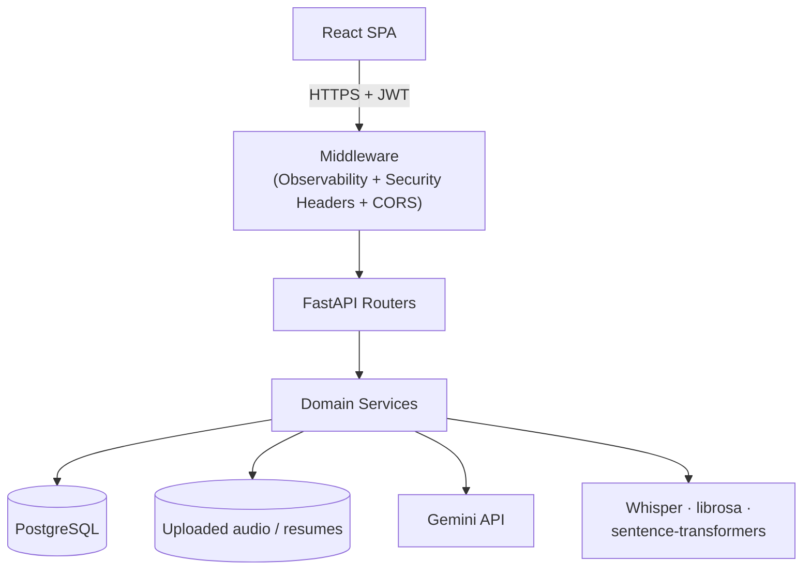
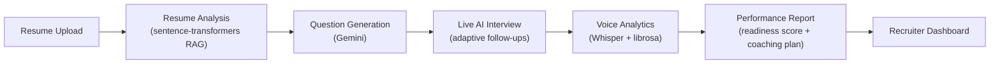
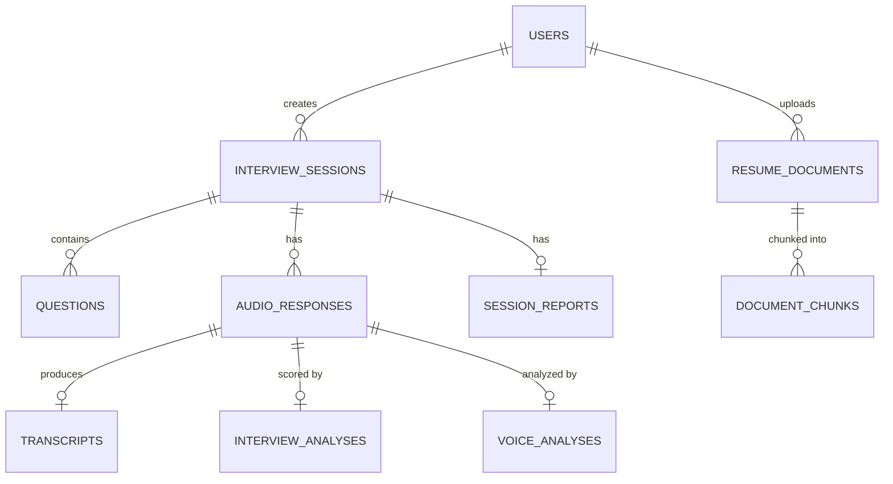

<div align="center">

# AI Interview Intelligence Platform

**AI-powered mock interview practice: question generation, audio transcription,
multi-dimensional evaluation, voice analytics, live conversational interviews,
resume-aware RAG questions, a transparent interview readiness score, and AI
career coaching.**

[](https://github.com/KeerthanaPothula/ai-interview-intelligence-platform/actions/workflows/ci.yml)
[](https://github.com/KeerthanaPothula/ai-interview-intelligence-platform/actions/workflows/security.yml)


**[Live demo](#screenshots)** · **[Architecture](#architecture)** · **[API docs](docs/API.md)**

</div>

---

### Demo

> An animated walkthrough (resume upload → live interview → readiness report)
> is not recorded yet — see the [Roadmap](#roadmap). In the meantime, the
> [Screenshots](#screenshots) section below shows every major screen from a
> real running instance, and the landing page (`/`) includes a captured
> screenshot carousel of the same views.

---

## Table of contents

- [Overview](#overview)
- [Features](#features)
- [Architecture](#architecture)
- [AI pipeline](#ai-pipeline)
- [Tech stack](#tech-stack)
- [Folder structure](#folder-structure)
- [Database](#database)
- [API](#api)
- [Local setup](#local-setup)
- [Environment variables](#environment-variables)
- [Deployment](#deployment)
- [Testing](#testing)
- [CI/CD](#cicd)
- [Monitoring & observability](#monitoring--observability)
- [Performance](#performance)
- [Security](#security)
- [Screenshots](#screenshots)
- [Documentation](#documentation)
- [Contributing](#contributing)
- [Roadmap](#roadmap)
- [Acknowledgements](#acknowledgements)
- [License](#license)

---

## Overview

Candidates create an interview session for a target job role, get
AI-generated interview questions, record audio answers, and receive an
automatic transcript plus a five-dimension AI evaluation with concrete
strengths, weaknesses, and feedback. Beyond the core loop, the platform adds
a live conversational AI interviewer, resume-aware RAG question generation,
a transparent, weighted-average **Interview Readiness Score** with percentile
benchmarking (a documented formula, not a machine-learned prediction of
hiring outcomes — see [docs/AI_PIPELINE.md §9](docs/AI_PIPELINE.md#9-interview-readiness-scoring--benchmarking-prediction_servicepy-benchmark_servicepy)),
and an AI career coach that produces 7/14/30-day improvement plans.

Built as a portfolio-quality, production-shaped project: JWT auth with
refresh-token rotation and per-user data isolation, an Alembic-migrated
PostgreSQL schema, hardened CORS and security headers, structured JSON
logging with Prometheus metrics and optional OpenTelemetry tracing, a
hardened multi-stage Docker build, and a green GitHub Actions CI/CD
pipeline.

## Features

### AI Features
- Gemini-powered question generation, categorized (behavioral / technical /
  situational) and ordered
- Shared retry/backoff + JSON-repair reliability layer
  (`app/core/ai_reliability.py`) used by every Gemini call site

### Interview System
- Create, list, update, and delete interview sessions
- Session lifecycle: `draft → in_progress → processing → completed`
- Per-response status tracking (`uploaded → processing → completed/failed`)
  with atomic claiming and startup recovery for crashed jobs
- **Live Conversational AI Interviewer** — multi-turn, context-aware
  interview where each question builds on prior answers and increases in
  difficulty
- AI-generated follow-up questions targeting vague or interesting parts of
  an answer

### Resume Intelligence
- Upload PDF/DOCX resumes — text extracted, chunked (200-word overlapping
  windows), embedded via sentence-transformers (`all-MiniLM-L6-v2`)
- Cosine-similarity retrieval over a candidate's own resume chunks drives
  personalized, resume-grounded Gemini question generation (RAG)

### Voice Analytics
- Librosa-based acoustic analysis: speaking rate (WPM), pause detection,
  filler-word counting, RMS energy consistency, and a composite confidence
  score (0–100)
- Runs as a best-effort enrichment step — a failure here never blocks the
  transcript/evaluation pipeline

### Career Coaching
- Gemini-generated 7/14/30-day personalized improvement plans, grounded in
  a session's scores, readiness level, and identified weaknesses
- **Interview Readiness Score** — a transparent, documented weighted average
  of a session's own scores (`Excellent` / `Strong` / `Developing` /
  `Needs Improvement`), plus percentile benchmarking against all platform
  users. This is a deterministic formula, not a trained ML model — it does
  not predict real-world interview or hiring outcomes. Exact weights:
  [docs/AI_PIPELINE.md §9](docs/AI_PIPELINE.md#9-interview-readiness-scoring--benchmarking-prediction_servicepy-benchmark_servicepy)

### Dashboard & Analytics
- Score-trend line chart and skill-breakdown radar chart across sessions
- Holistic, Gemini-generated session reports: performance narrative,
  strengths/weaknesses, improvement plan, readiness level

### Security
- bcrypt password hashing, JWT access tokens with an instant-revocation
  `token_version` claim, SHA-256-hashed rotating refresh tokens
- Per-IP login rate limiting + progressive-backoff account lockout
- Layered file-upload validation (MIME allow-list, size limit, magic-byte
  signature check, filename sanitization)
- Security headers (CSP, X-Frame-Options, HSTS in production, etc.) on
  every response
- See [SECURITY.md](SECURITY.md) for full detail and accepted trade-offs

### Infrastructure
- Multi-stage, non-root Docker build; Docker Compose for local dev
- Alembic-migrated PostgreSQL (SQLite for tests), migrations applied
  automatically on container start, persistent storage strategy for
  uploaded audio

### DevOps
- GitHub Actions CI (lint, test + coverage, build, Docker validation) and a
  separate security workflow (`pip-audit`, `npm audit`, CodeQL)
- Structured JSON logging, Prometheus metrics, optional OpenTelemetry
  tracing, `/health` + `/ready` endpoints

## Architecture



This is the condensed view. Full system architecture, request-flow,
authentication-flow, interview-workflow, and deployment diagrams (all
Mermaid) are in **[docs/ARCHITECTURE.md](docs/ARCHITECTURE.md)**; the
step-by-step AI pipelines (Whisper, Gemini evaluation, voice analytics,
RAG, live interviews, readiness scoring, coaching) are in
**[docs/AI_PIPELINE.md](docs/AI_PIPELINE.md)**.

## AI pipeline

Seven stages, from upload to the recruiter-facing dashboard:



1. **Resume Upload** — PDF/DOCX parsed and chunked into 200-word overlapping windows.
2. **Resume Analysis** — chunks embedded with `sentence-transformers` (`all-MiniLM-L6-v2`); cosine-similarity retrieval grounds question generation in the candidate's actual experience (RAG).
3. **Question Generation** — Gemini generates categorized (behavioral/technical/situational) questions from the resume + target job description.
4. **Live AI Interview** — a multi-turn conversational session where each follow-up question is generated from the candidate's prior answer.
5. **Voice Analytics** — Whisper transcribes recorded answers; `librosa` derives speaking rate, pauses, filler words, and energy consistency.
6. **Performance Report** — Gemini produces a holistic report; a transparent, documented weighted formula computes the Interview Readiness Score (not a trained outcome-prediction model — see [docs/AI_PIPELINE.md §9](docs/AI_PIPELINE.md#9-interview-readiness-scoring--benchmarking-prediction_servicepy-benchmark_servicepy)).
7. **Recruiter Dashboard** — every candidate's latest completed interview aggregated into a searchable, sortable, paginated ranking.

## Tech stack

### Backend

| Technology | Purpose |
|---|---|
| FastAPI | Web framework |
| SQLAlchemy 2.x | ORM |
| Alembic | Database migrations |
| Pydantic v2 / pydantic-settings | Schemas + typed, validated settings |
| python-jose | JWT signing/verification |
| bcrypt | Password hashing |
| Uvicorn | ASGI server |

### Frontend

| Technology | Purpose |
|---|---|
| React 19 | UI |
| TypeScript | Type safety |
| Vite | Build tool / dev server |
| React Router v6 | Routing |
| Recharts | Score-trend line chart + skill radar chart |

### AI/ML

| Technology | Purpose |
|---|---|
| Google Gemini (`google-genai`) | Questions, evaluation, follow-ups, live interviews, RAG questions, reports, coaching |
| OpenAI Whisper + PyTorch (CPU) | Audio transcription |
| librosa | Voice/acoustic analytics |
| sentence-transformers (`all-MiniLM-L6-v2`) | Resume/RAG embeddings |

### Database

| Technology | Purpose |
|---|---|
| PostgreSQL 16 | Production / Docker Compose |
| SQLite (in-memory) | Test suite |

### DevOps

| Technology | Purpose |
|---|---|
| Docker (multi-stage, non-root) | Backend image |
| Docker Compose | Local dev (backend + PostgreSQL) |
| GitHub Actions | CI/CD (`ci.yml`, `security.yml`) |
| Prometheus / OpenTelemetry | Metrics / tracing |

### Deployment

| Platform | Role |
|---|---|
| Render | Backend (Docker Web Service + Disk) + managed PostgreSQL + Static Site |
| Railway | Alternative backend host (Docker + Volume + PostgreSQL plugin) |
| Vercel | Alternative frontend static host |

### Testing

| Technology | Purpose |
|---|---|
| pytest + httpx | Backend (267 tests) |
| Vitest + React Testing Library | Frontend (31 tests) |
| Playwright | End-to-end (1 full-flow spec, local only — requires real Gemini key) |

## Folder structure

```
ai-interview-intelligence-platform/
├── backend/
│   ├── app/
│   │   ├── main.py            # FastAPI app, middleware, health/ready/metrics
│   │   ├── config.py          # Typed, validated settings (pydantic-settings)
│   │   ├── database.py        # SQLAlchemy engine/session
│   │   ├── models/            # ORM models (user, interview, analysis, documents, features, prediction, ...)
│   │   ├── schemas/           # Pydantic request/response schemas, one file per domain
│   │   ├── routers/           # FastAPI routers — one file per resource (auth, interviews, admin, recruiter, ...)
│   │   ├── services/          # Business logic: Gemini/Whisper/RAG calls, aggregation, scoring
│   │   └── core/              # Cross-cutting: security, rate limiting, middleware, observability
│   ├── alembic/                # Database migrations
│   ├── tests/                  # pytest suite (267 tests)
│   └── requirements.txt
├── frontend/
│   ├── src/
│   │   ├── pages/              # One component per route (Dashboard, Resume, Recruiter, Admin, ...)
│   │   ├── components/         # Shared UI (Sidebar, TopBar, cards, skeletons, carousel, ...)
│   │   ├── api/                 # Typed fetch client + response types (client.ts, types.ts)
│   │   ├── context/             # React context providers (Auth, Theme, Toast, Features)
│   │   └── index.css            # Design-token system + every component's styles
│   └── package.json
├── docs/                        # Architecture, API, database, deployment, security, testing docs
├── docker-compose.yml            # Local dev stack (backend + PostgreSQL)
├── render.yaml                   # Render Blueprint (production backend)
└── .env.example                  # Every environment variable, documented inline
```

## Database

16 tables, every row traceable to a `users.id` owner, UUID primary keys
generated in application code, cascading deletes on session/user removal.



Full entity-relationship diagram (all 16 tables with complete attribute
lists, cascade behavior, and the 7-revision migration history) is in
**[docs/DATABASE.md](docs/DATABASE.md)**.

## API

53 endpoints across health/observability, auth, interview sessions,
audio responses, processing, follow-ups, session reports, live
conversational interviews, resume/RAG, readiness scoring/coaching,
recruiter aggregation, and the admin dashboard.
All routes except `/health`, `/ready`, `/metrics`, and the auth
register/login/refresh endpoints require `Authorization: Bearer <token>`.
Interactive docs (`/docs`, `/redoc`) are available whenever `DEBUG=true`.

| Method | Path | Description |
|---|---|---|
| `GET` | `/health` | Liveness check (no DB access) |
| `GET` | `/ready` | Readiness check (DB + AI config) |
| `GET` | `/metrics` | Prometheus metrics |
| `POST` | `/api/v1/auth/register` | Create a user |
| `POST` | `/api/v1/auth/login` | Exchange credentials for access + refresh tokens |
| `POST` | `/api/v1/auth/refresh` | Rotate a refresh token for a new token pair |
| `GET` | `/api/v1/auth/me` | Get the current user |
| `POST` | `/api/v1/interviews/` | Create an interview session |
| `POST` | `/api/v1/interviews/{id}/questions/generate` | Generate questions via Gemini |
| `POST` | `/api/v1/interviews/{session_id}/responses` | Upload an audio response (multipart) |
| `GET` | `/api/v1/responses/{id}/processing-status` | Poll processing status (used by the UI) |
| `GET` | `/api/v1/responses/{id}/transcript` | Get the Whisper transcript |
| `GET` | `/api/v1/responses/{id}/analysis` | Get the Gemini evaluation |
| `POST` | `/api/v1/live-interviews/` | Start a live conversational interview |
| `POST` | `/api/v1/documents/resume/upload` | Upload a resume for RAG |
| `POST` | `/api/v1/interviews/{id}/readiness` | Compute the interview readiness score |
| `POST` | `/api/v1/interviews/{id}/coaching-plan` | Generate a career coaching plan |
| `GET` | `/api/v1/recruiter/candidates` | Paginated, searchable, sortable candidate ranking |
| `GET` | `/api/v1/admin/overview` | Platform-wide usage, AI activity, and storage stats |
| `GET` | `/api/v1/admin/users` | Every registered user with session activity |

Every endpoint — including full request/response JSON examples and error
codes — is documented in **[docs/API.md](docs/API.md)**.

## Local setup

### Docker (recommended)

```bash
cp .env.example .env   # fill in JWT_SECRET_KEY and GEMINI_API_KEY
docker-compose up --build
docker-compose exec backend alembic upgrade head   # first run only
```

Backend at `http://localhost:8000`.

### Without Docker

```bash
# Backend
cd backend
python -m venv .venv && source .venv/bin/activate   # Windows: .venv\Scripts\activate
pip install -r requirements.txt
cp ../.env.example ../.env
alembic upgrade head
uvicorn app.main:app --reload

# Frontend (separate terminal)
cd frontend
npm install
cp .env.example .env   # VITE_API_BASE_URL=http://localhost:8000
npm run dev
```

Frontend at `http://localhost:5173`. Full setup, common commands, a
debugging guide, and the migration workflow are in
**[docs/DEVELOPMENT.md](docs/DEVELOPMENT.md)**.

## Environment variables

All variables live in **[.env.example](.env.example)**, documented inline
at the point of use. The ones you actually need to set for local dev:

| Variable | Required | Purpose |
|---|---|---|
| `DATABASE_URL` | Yes | SQLAlchemy connection string (PostgreSQL in Docker/prod) |
| `JWT_SECRET_KEY` | Yes | Signs/verifies access & refresh tokens — generate with `openssl rand -hex 32` |
| `GEMINI_API_KEY` | Yes | Google AI Studio key — questions, evaluation, RAG, live interviews, coaching |
| `CORS_ORIGINS` | Yes | Comma-separated allow-list; empty disables credentialed CORS entirely |
| `ENVIRONMENT` | No (default `development`) | `development` \| `production` — gates traceback detail and `/docs` |
| `DEBUG` | No (default `true`) | Must be `false` in production |
| `WHISPER_MODEL` | No (default `base`) | Whisper model size — bigger = more accurate, slower, more RAM |
| `ENABLE_AUDIO_PROCESSING` | No (default `true`) | Kill switch for the Whisper/voice pipeline |
| `MAX_UPLOAD_SIZE_MB` | No (default `50`) | Audio/resume upload ceiling |
| `ENABLE_METRICS` | No (default `true`) | Toggles the `/metrics` Prometheus endpoint |
| `ENABLE_TRACING` | No (default `false`) | Opt-in OpenTelemetry tracing |
| `VITE_API_BASE_URL` | Yes (frontend) | Backend origin the SPA calls — set in `frontend/.env` |

The full list (29 variables total, including JWT expiry, transcription
limits, rate-limit tuning, and OpenTelemetry exporter config) is in
`.env.example` and **[docs/DEVELOPMENT.md](docs/DEVELOPMENT.md)**.

## Deployment

### Production architecture

```
Vercel (frontend) → Render Web Service (backend) → Neon PostgreSQL
```

| Service | Platform | Config |
|---|---|---|
| Frontend | Vercel (Hobby, free) | `frontend/vercel.json` — SPA rewrites |
| Backend | Render Standard ($25/mo) | `render.yaml` — Docker + Disk + migration on container start |
| Database | Neon PostgreSQL (free tier) | External; `DATABASE_URL` with `sslmode=require` |

One-click deploy via Render Blueprint (reads `render.yaml`):
1. Render → New → Blueprint → connect this repo → Apply.
2. Set three secrets in Render dashboard: `DATABASE_URL`, `GEMINI_API_KEY`, `CORS_ORIGINS`.
3. Vercel → New Project → Root Directory: `frontend` → set `VITE_API_BASE_URL`.

Full step-by-step instructions, migration workflow, environment variable
reference, and post-deploy verification checklist are in
**[docs/PRODUCTION_DEPLOYMENT.md](docs/PRODUCTION_DEPLOYMENT.md)**.

Database migration strategy, persistent storage approach, and
platform-specific notes (Railway alternative) are in
**[docs/DEPLOYMENT.md](docs/DEPLOYMENT.md)**.

## Testing

```bash
cd backend && pytest --cov=app --cov-report=term-missing   # 267 tests
cd frontend && npm run coverage                             # 31 tests
cd frontend && npx playwright test                          # E2E — requires real GEMINI_API_KEY + running stack
```

Backend coverage is healthy (80%) across auth, session CRUD, the
processing pipeline state machine, and security controls. Frontend
coverage is low (~10%, and dropped from ~25% as new pages shipped without
tests alongside them — see [docs/TESTING.md](docs/TESTING.md)) and
concentrated on a few components built
test-first — several pages currently have zero coverage. This gap is
documented honestly, not hidden, in
**[docs/TESTING.md](docs/TESTING.md)**, along with what's well-tested and
where a new contributor could add the most value.

## CI/CD

Two GitHub Actions workflows run on every push to `main` and every pull
request:

- **`ci.yml`** — backend lint (`ruff` + `black`), frontend lint
  (`eslint`), backend tests + coverage (gated at 75%), frontend tests +
  coverage (gated at a low 7-8% tripwire, not a quality bar — see
  [Testing](#testing)), frontend build verification, and a Docker build
  validation.
- **`security.yml`** — `pip-audit`, `npm audit`, and GitHub CodeQL static
  analysis.

Full job-by-job breakdown in **[docs/INFRASTRUCTURE.md](docs/INFRASTRUCTURE.md)**.

## Monitoring & observability

- **Structured JSON logging** with request-ID correlation
  (`ObservabilityMiddleware`), slow-request warnings, and a dedicated
  security-event logger.
- **Prometheus metrics** at `/metrics` — HTTP request/error counts and
  latency histograms, AI call counts/latency by provider, DB query
  duration, background-task outcomes.
- **OpenTelemetry tracing** (opt-in via `ENABLE_TRACING=true`) — automatic
  HTTP/SQLAlchemy spans plus manual spans around every Gemini/Whisper/RAG
  call site.
- **`/health`** (liveness, no DB access) and **`/ready`** (readiness — DB
  connectivity + AI config check) for orchestrator probes.

Full detail in **[docs/INFRASTRUCTURE.md](docs/INFRASTRUCTURE.md)**.

## Performance

**Backend**
- Indexed foreign keys and status/timestamp columns on every high-traffic
  table; `joinedload`/`selectinload` used at the known N+1 sites
  (responses, processing, live interview) instead of lazy per-row queries.
- Route-level pagination (`skip`/`limit`, capped at 100) on session,
  recruiter, and admin list endpoints.
- Background tasks for audio processing so upload requests return
  immediately instead of blocking on Whisper/Gemini.

**Frontend**
- Route-based code splitting (`React.lazy` + `Suspense`) — every
  authenticated page ships as its own chunk, confirmed in the production
  build output (`AdminPage`, `RecruiterPage`, `AnalyticsPage`, etc. are all
  separate `dist/assets/*.js` files, not bundled into one).
- `useMemo`/`useCallback` on derived chart data and expensive filtering
  (recruiter/admin tables, analytics trend filtering).
- Skeleton loading states everywhere data is fetched, so the UI never
  blocks on a blank screen.

**Known gap, documented honestly, not hidden:** there's no Redis (or
other) response cache — every request hits PostgreSQL directly. At this
project's scale that's the right trade-off (a cache adds an invalidation
problem for very little payoff at low request volume); see
[docs/AI_PIPELINE.md](docs/AI_PIPELINE.md) and the [Roadmap](#roadmap)
for what a horizontally-scaled deployment would need instead.

## Security

- JWT access tokens with an instantly-revocable `token_version` claim;
  refresh tokens stored only as SHA-256 hashes and rotated on every use.
- Per-IP login rate limiting and progressive-backoff account lockout.
- Layered file-upload validation: MIME allow-list, size ceiling,
  magic-byte signature check, filename sanitization, and a malware-scan
  integration point.
- Security headers (CSP, X-Frame-Options, X-Content-Type-Options,
  Referrer-Policy, Permissions-Policy, HSTS in production) on every
  response.
- Ownership enforcement returns `404` (not `403`) on cross-user access, to
  avoid leaking resource existence.

Full detail, known limitations, and upgrade paths are documented in the
root **[SECURITY.md](SECURITY.md)** (with a short pointer at
[docs/SECURITY.md](docs/SECURITY.md)).

## Screenshots

The landing page (`/`) embeds a live, auto-advancing carousel of the
screenshots below — all captured from a real running instance (seeded
data, not mockups). The same files live in
`frontend/public/screenshots/`.

| View | File |
|---|---|
| Landing page | [frontend/public/screenshots/landing.png](frontend/public/screenshots/landing.png) |
| Dashboard | [frontend/public/screenshots/dashboard.png](frontend/public/screenshots/dashboard.png) |
| Resume analysis | [frontend/public/screenshots/resume.png](frontend/public/screenshots/resume.png) |
| Live AI interview | [frontend/public/screenshots/interview.png](frontend/public/screenshots/interview.png) |
| Analytics center | [frontend/public/screenshots/analytics.png](frontend/public/screenshots/analytics.png) |
| Recruiter dashboard | [frontend/public/screenshots/recruiter.png](frontend/public/screenshots/recruiter.png) |
| Admin dashboard | [frontend/public/screenshots/admin.png](frontend/public/screenshots/admin.png) |

An earlier, separate set of auth-flow screenshots (login, register, an
empty session list/detail) lives in `docs/screenshots/` — see
[docs/screenshots.md](docs/screenshots.md).

## Documentation

| Doc | Covers |
|---|---|
| [docs/PRODUCTION_DEPLOYMENT.md](docs/PRODUCTION_DEPLOYMENT.md) | **Production deploy: Neon + Render + Vercel (start here)** |
| [docs/ARCHITECTURE.md](docs/ARCHITECTURE.md) | System, request-flow, auth-flow, deployment diagrams |
| [docs/FOLDER_STRUCTURE.md](docs/FOLDER_STRUCTURE.md) | File-by-file map of both codebases |
| [docs/DATABASE.md](docs/DATABASE.md) | Full ER diagram, table reference, migrations |
| [docs/API.md](docs/API.md) | Every endpoint, with request/response examples |
| [docs/AI_PIPELINE.md](docs/AI_PIPELINE.md) | Step-by-step AI processing pipelines |
| [docs/SECURITY.md](docs/SECURITY.md) | Pointer to the root [SECURITY.md](SECURITY.md) |
| [docs/DEPLOYMENT.md](docs/DEPLOYMENT.md) | Migrations, storage, Render/Railway/Vercel |
| [docs/RENDER_DEPLOYMENT.md](docs/RENDER_DEPLOYMENT.md) | Step-by-step Render setup |
| [docs/INFRASTRUCTURE.md](docs/INFRASTRUCTURE.md) | CI/CD, Docker, logging, metrics, tracing |
| [docs/DEVELOPMENT.md](docs/DEVELOPMENT.md) | Setup, commands, env vars, debugging, migrations |
| [docs/TESTING.md](docs/TESTING.md) | Test suites, honest coverage numbers |
| [docs/TROUBLESHOOTING.md](docs/TROUBLESHOOTING.md) | CI, Docker, deployment issues |
| [docs/CONTRIBUTING.md](docs/CONTRIBUTING.md) | PR workflow, GitHub project setup |
| [docs/CHANGELOG.md](docs/CHANGELOG.md) | Project history by date |
| [CODE_OF_CONDUCT.md](CODE_OF_CONDUCT.md) | Community standards |

## Contributing

Issues, bug reports, and pull requests are welcome.

1. For anything beyond a small fix, open an issue first so the approach
   can be discussed before you invest time in an implementation.
2. Fork the repo, branch off `main`, keep the change focused.
3. Before opening a PR: backend `ruff check .`, `black --check .`,
   `pytest`; frontend `npm run lint`, `npm run test`, `npm run build`.
4. Open a PR against `main`; CI must pass.

Full workflow, commit-message conventions, and review expectations are in
**[docs/CONTRIBUTING.md](docs/CONTRIBUTING.md)**. Participation means
agreeing to the **[Code of Conduct](CODE_OF_CONDUCT.md)**.

## Roadmap

### Completed

- ✅ Core interview loop: question generation, audio upload, Whisper
  transcription, Gemini evaluation
- ✅ JWT auth with refresh-token rotation, account lockout, rate limiting
- ✅ Voice analytics (librosa), AI follow-up interviewer, analytics
  dashboard, session reports
- ✅ Live conversational AI interviews
- ✅ Resume/JD RAG question generation
- ✅ Interview readiness scoring (transparent weighted formula + percentile benchmarking)
- ✅ AI career coaching (7/14/30-day plans)
- ✅ Production infrastructure: observability, CI/CD, hardened Docker
- ✅ Open-source documentation overhaul (this pass)
- ✅ Frontend polish: toasts, skeleton loaders, empty/error states, a11y, resume upload UI, session report UI
- ✅ End-to-end Playwright test suite (full Register→Dashboard flow)
- ✅ First production release: v1.0.0 (see [RELEASE.md](RELEASE.md))
- ✅ Recruiter dashboard on live backend data (search, sort, pagination)
- ✅ Admin dashboard — users, interviews, AI usage, storage, platform
  health, all real queries, no mock data
- ✅ PDF export for AI interview reports
- ✅ Dark/light theme system (centralized tokens, persisted, no flash of
  wrong theme, WCAG-AA contrast in both themes)
- ✅ Landing page redesign — AI pipeline timeline, architecture diagram,
  live screenshot carousel, animated stats

### Future enhancements

- 🔲 In-browser audio recording (`MediaRecorder`) instead of file upload only
- 🔲 Frontend test coverage for currently-untested pages (see
  [docs/TESTING.md](docs/TESTING.md#known-gap--this-is-the-honest-state-not-a-target))
- 🔲 Object storage (S3/R2) for uploaded audio, enabling horizontal scaling
- 🔲 A job queue (Celery/RQ) for the processing pipeline instead of
  in-process background tasks
- 🔲 Redis-backed rate limiting for multi-worker/multi-instance deployments
- 🔲 A real malware-scanning backend behind the current stub hook
- 🔲 A role/organisation model (`User.role`) so the recruiter and admin
  dashboards can be gated instead of open to any authenticated user — an
  explicit, documented trade-off for this single-tenant-schema MVP, not
  an oversight (see `app/services/admin_service.py` docstring)
- ✅ Tagged releases with semantic versioning — first tag: `v1.0.0`
- 🔲 A genuinely ML-based readiness/outcome model trained on real, labeled
  interview outcomes (the current readiness score is an intentionally
  transparent weighted formula, not a trained model — see
  [docs/AI_PIPELINE.md §9](docs/AI_PIPELINE.md#9-interview-readiness-scoring--benchmarking-prediction_servicepy-benchmark_servicepy));
  this would require a real labeled dataset, which doesn't exist yet

## Acknowledgements

Built on top of these open-source projects and APIs:

- [FastAPI](https://fastapi.tiangolo.com/), [SQLAlchemy](https://www.sqlalchemy.org/), [Alembic](https://alembic.sqlalchemy.org/), [Pydantic](https://docs.pydantic.dev/)
- [React](https://react.dev/), [Vite](https://vitejs.dev/), [React Router](https://reactrouter.com/), [Recharts](https://recharts.org/), [Framer Motion](https://www.framer.com/motion/), [lucide-react](https://lucide.dev/)
- [Google Gemini](https://ai.google.dev/) for question generation, evaluation, live interviews, and coaching
- [OpenAI Whisper](https://github.com/openai/whisper) for audio transcription
- [sentence-transformers](https://www.sbert.net/) (`all-MiniLM-L6-v2`) for resume/RAG embeddings
- [librosa](https://librosa.org/) for voice/acoustic analysis
- [PostgreSQL](https://www.postgresql.org/), [Docker](https://www.docker.com/)

## License

Released under the [MIT License](LICENSE).
