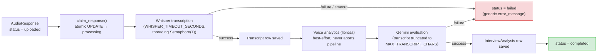
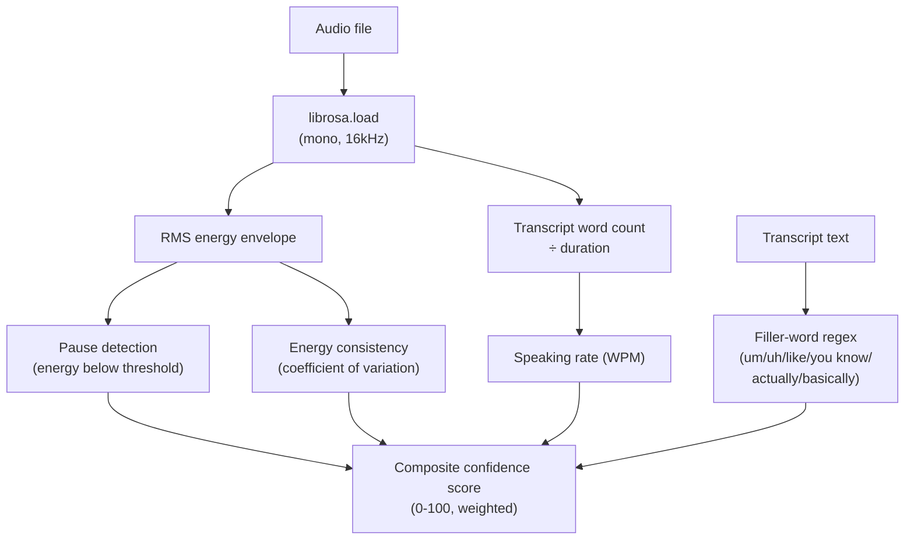
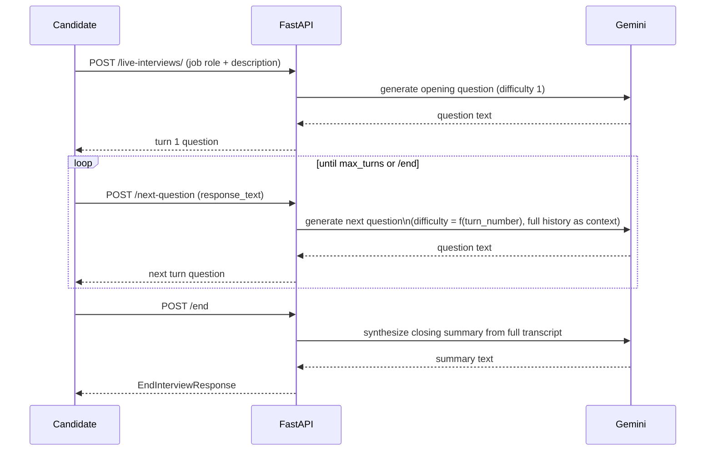
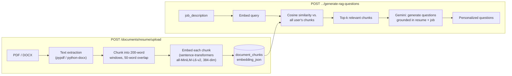

# AI Pipeline

Every AI capability in this platform is driven by one of three engines:

| Engine | Where it runs | Used for |
|---|---|---|
| **Google Gemini** (`google-genai`) | Remote API call | Question generation, response evaluation, follow-ups, live interviews, RAG questions, session reports, career coaching |
| **OpenAI Whisper** (CPU, in-process) | Local inference, no network call | Audio transcription |
| **librosa / sentence-transformers** | Local inference, no network call | Voice analytics, resume embeddings |

This document covers what each pipeline does, in what order, and the
reliability patterns shared across all of them. For the database rows each
step writes, see [DATABASE.md](./DATABASE.md); for the HTTP surface, see
[API.md](./API.md).

---

## 1. Audio response pipeline (Whisper → Gemini → librosa)

The core pipeline, run by `processing_service.py` either via a background
task right after upload or on-demand via `POST /responses/{id}/process`.



**Reliability properties:**

- **Atomic claiming**: `claim_response()` uses a conditional `UPDATE ... WHERE
  status = 'uploaded'` so two concurrent triggers (e.g. a retry racing the
  original background task) can't both process the same response.
- **One Whisper inference at a time**: a process-wide `threading.Semaphore(1)`
  serializes transcription calls — the model is loaded once per process
  (double-checked locking) and is not thread-safe for concurrent inference.
- **Voice analytics never blocks the pipeline**: if `librosa` raises (or
  isn't installed), the response still reaches `completed` — voice metrics
  are an enrichment, not a dependency for the transcript/analysis to exist.
- **Idempotent retries**: re-running `process()` on a response that already
  has a transcript skips re-transcription and goes straight to evaluation —
  cheap to retry after a transient Gemini failure without re-running Whisper.
- **Startup recovery**: any response still in `processing` when the backend
  starts (e.g. after a crash) is reset to `failed`, so it isn't stuck forever
  un-retriable.

## 2. Question generation (`gemini_service.py`)

`POST /interviews/{id}/questions/generate` sends the job role + description
to Gemini and asks for `MAX_QUESTIONS_PER_SESSION` (default 10) categorized
questions (`behavioral` / `technical` / `situational`). The raw response is:

1. Stripped of markdown code fences (Gemini often wraps JSON in ` ```json `).
2. Parsed as JSON; on parse failure, a bracket-extraction repair pass is
   attempted before giving up.
3. Validated per-question — an unrecognized `category` falls back to
   `behavioral` rather than rejecting the whole batch.
4. Assigned `sequence_order` deterministically (the order Gemini returned
   them in), not derived from any field in the response.

## 3. Response evaluation (`evaluation_service.py`)

Once a transcript exists, it (truncated to `MAX_TRANSCRIPT_CHARS`, default
20,000) plus the original question and job context are sent to Gemini,
which scores the answer 0.0–10.0 on four dimensions plus an overall score,
and returns `strengths`/`weaknesses` as JSON arrays and free-text
`detailed_feedback`. Scores are validated and clamped after parsing — Gemini
occasionally returns `10.5` or a string instead of a float, and the service
treats that as a malformed response to retry rather than persisting an
out-of-range score (the database's `CHECK` constraints would reject it
anyway — see [DATABASE.md](./DATABASE.md)).

## 4. Voice analytics (`voice_analysis_service.py`)



Runs after transcription succeeds, using both the audio file and its
transcript. Produces speaking rate (WPM), average/total pause duration, long
pause count, filler-word count, energy consistency (0.0–1.0), and a single
composite confidence score (0–100) that weights all of the above. This step
is best-effort: any exception here is caught and logged, and processing
continues without a `voice_analyses` row rather than failing the response.

## 5. Follow-up questions (`follow_up_service.py`)

`POST /interviews/{id}/follow-up-question` sends one already-transcribed
response plus the original question and job context to Gemini, asking for
one targeted follow-up that probes a vague or particularly interesting part
of the answer. Returns plain question text — no JSON parsing needed for this
call, since the response is a single string rather than a structured object.

## 6. Live conversational interviews (`interview_conversation_service.py`)



Each turn's difficulty (`difficulty_level`, 1–5) scales with `turn_number`,
and every Gemini call for turn *n* includes the full prior conversation as
context — later questions build on earlier answers rather than being
independently generated.

## 7. Resume RAG pipeline (`rag_service.py`, `embedding_service.py`)



`sentence-transformers`' model is lazy-loaded on first use (not at process
startup) to avoid the ~90 MB download/load cost on every cold start of a
deployment that never uses RAG. Embeddings are stored as JSON-encoded float
arrays in a `Text` column (`document_chunks.embedding_json`) rather than a
vector database — cosine similarity is computed in Python over the user's
own chunks, which is small enough per-user (one resume, tens of chunks) that
an external vector store (pgvector, Pinecone, etc.) isn't justified yet.

## 8. Session reports (`report_service.py`)

`POST /interviews/{id}/report/generate` aggregates every analyzed response
in the session (average scores per category, plus voice-analytics
confidence where available) and asks Gemini for a holistic narrative:
overall performance summary, strengths/weaknesses, a written improvement
plan, and a `readiness_level` classification (`Beginner` →
`Highly Competitive`).

## 9. Interview readiness scoring & benchmarking (`prediction_service.py`, `benchmark_service.py`)

- **Readiness score**: `POST /interviews/{id}/readiness` computes a
  **transparent, deterministic weighted average** of the session's own
  component scores (30% overall, 20% communication, 25% technical, 15%
  problem-solving, 10% confidence, with a small filler-word penalty — the
  exact weights live in `prediction_service.py`). This is **not** a
  machine-learned model and makes no claim to predict a real-world
  interview or hiring outcome — it has no training step, no synthetic
  data, and no dependency on scikit-learn or any ML library. It exists to
  summarise signals already shown elsewhere in the product into one
  number and a readiness label (`Excellent` / `Strong` / `Developing` /
  `Needs Improvement`).
- **Benchmarking**: `GET /analytics/benchmarks` computes the caller's
  percentile rank against every other platform user's average score, using
  SQL `COUNT`/`AVG` aggregates rather than loading all users' rows into
  Python — this keeps the endpoint's cost flat regardless of platform size.

## 10. Career coaching (`career_coach_service.py`)

`POST /interviews/{id}/coaching-plan` sends the session's scores,
`readiness_level`, and identified weaknesses to Gemini and asks for three
structured action-step lists (7-day, 14-day, 30-day) plus a short list of
focus areas — stored as JSON arrays in `Text` columns.

---

## Shared Gemini reliability layer (`app/core/ai_reliability.py`)

Every one of the six Gemini call sites above (question generation,
evaluation, follow-ups, live interviews, RAG questions, session reports,
career coaching) is routed through the same two helpers, so a single fix or
behavior change applies everywhere at once:

- **`call_gemini_with_retry()`** — wraps a zero-arg callable with
  exponential backoff (`GEMINI_RETRY_BACKOFF_SECONDS`, up to
  `GEMINI_MAX_RETRIES` attempts) on timeouts, `429` rate limits, and `5xx`
  responses. Emits `ai_requests_total` / `ai_request_duration_seconds`
  Prometheus metrics labeled by `provider` and `operation` (see
  [INFRASTRUCTURE.md](./INFRASTRUCTURE.md)), and a `gemini.<operation>`
  OpenTelemetry span when tracing is enabled.
- **`parse_json_response()`** — strips markdown code fences, parses JSON,
  and falls back to bracket-extraction repair (finding the outermost
  `{...}`/`[...]` in a response that included extra prose around the JSON)
  before giving up and raising.

This means a Gemini outage or rate-limit event degrades gracefully (bounded
retries, then a generic `502`/`503` to the client) identically across every
AI feature, rather than each service reimplementing its own retry logic.

## Related documentation

- [API.md](./API.md) — request/response shapes for every endpoint above.
- [DATABASE.md](./DATABASE.md) — the tables each pipeline step writes to.
- [INFRASTRUCTURE.md](./INFRASTRUCTURE.md) — metrics and tracing around AI calls.
- [ARCHITECTURE.md](./ARCHITECTURE.md) — where these pipelines sit in the overall system.
