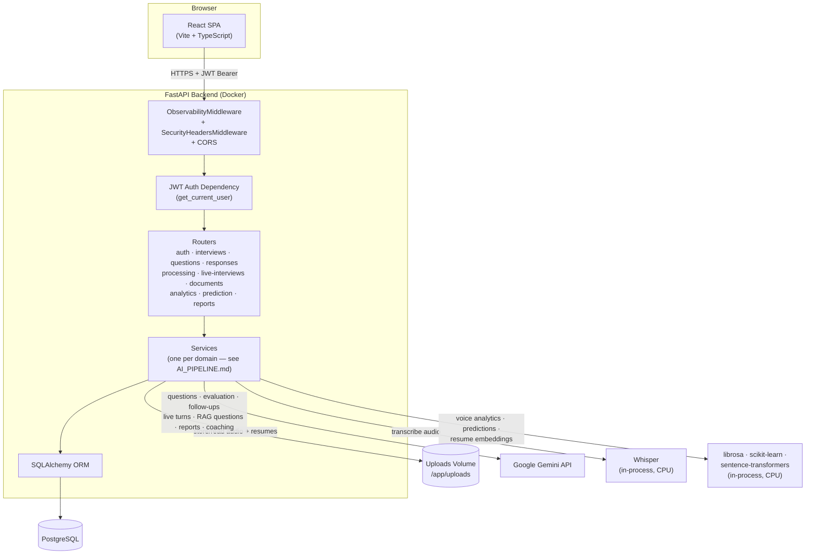
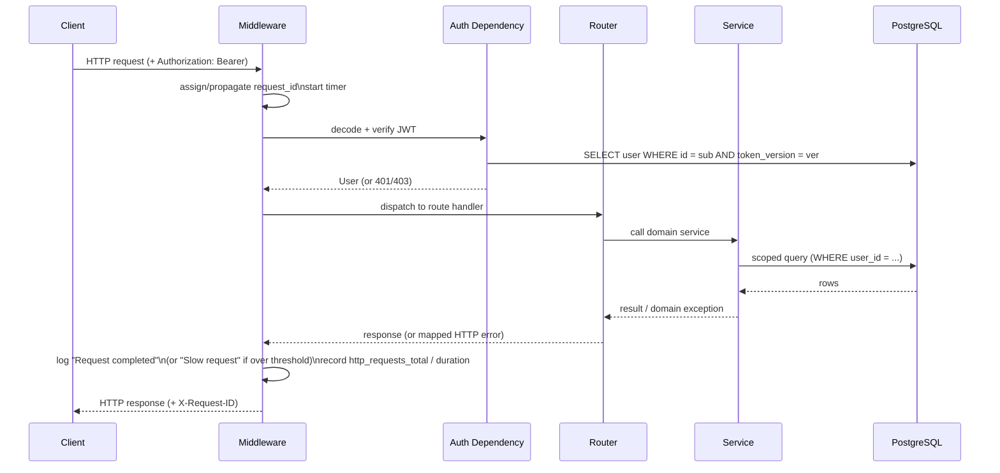
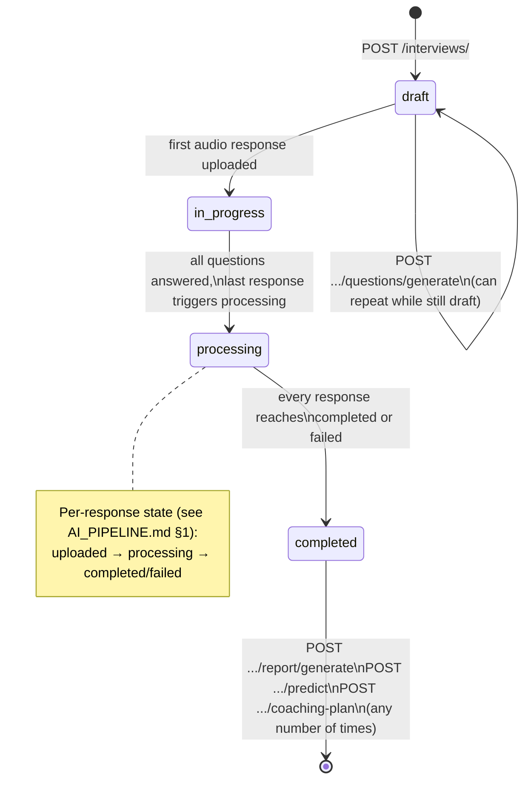
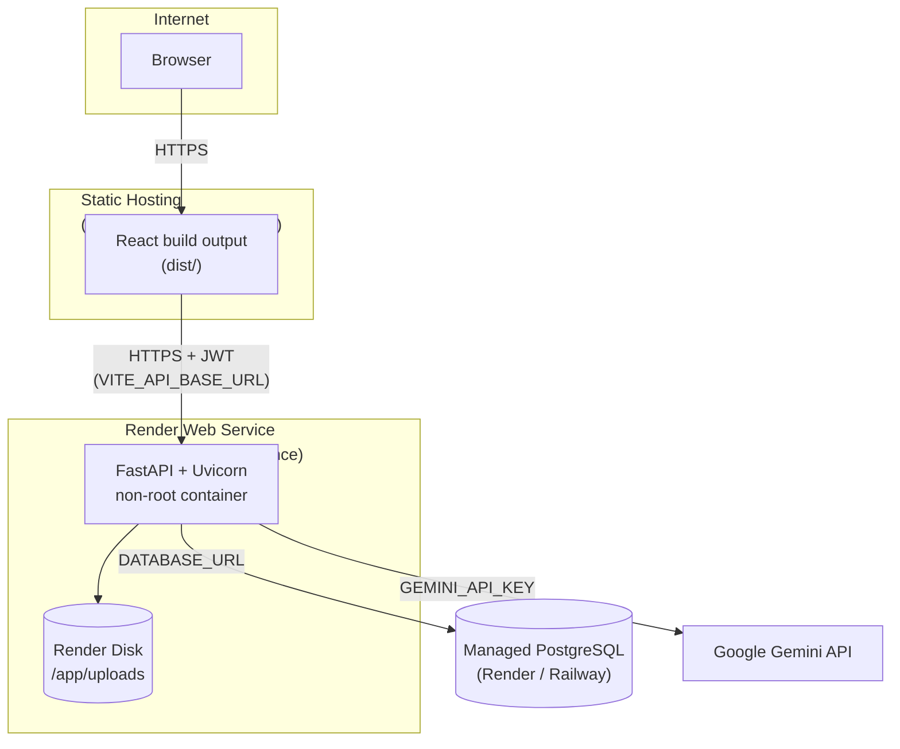
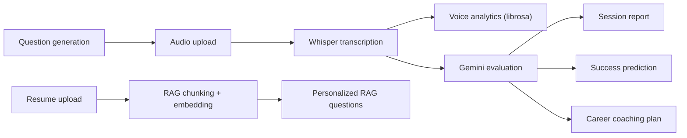

# Architecture

System-level views of the platform: how requests flow through it, how
authentication works, how a candidate's session progresses end-to-end, and
how the pieces are deployed. For the detailed, step-by-step AI processing
logic (Whisper, Gemini, librosa, RAG, prediction), see
[AI_PIPELINE.md](./AI_PIPELINE.md) — this document stays at the structural
level and links into it.

---

## 1. System Architecture



**Key points**

- The SPA never talks to PostgreSQL, Gemini, Whisper, or any local ML model
  directly — every external interaction is mediated by the FastAPI backend.
- Whisper, librosa, scikit-learn, and sentence-transformers all run
  **in-process** as the backend's own Python dependencies — there is no
  separate ML microservice to deploy or keep in sync.
- `CORS_ORIGINS` and the JWT dependency gate every route except `/health`,
  `/ready`, `/metrics`, and the three unauthenticated auth endpoints
  (register/login/refresh).
- Uploaded audio and resumes are written to a volume (a `docker-compose`
  bind mount locally, a Render Disk in production) so files survive
  container restarts — see [§5 Deployment](#5-deployment-architecture).

## 2. Request Flow



Every request is logged exactly once as structured JSON with its `request_id`,
route template, status code, and duration; see
[INFRASTRUCTURE.md](./INFRASTRUCTURE.md#logging) for the log shape and
[SECURITY.md](../SECURITY.md) for what is deliberately never logged.

## 3. Authentication Flow

```mermaid
sequenceDiagram
    participant C as Client
    participant API as FastAPI
    participant DB as PostgreSQL

    Note over C,API: Login
    C->>API: POST /auth/login (email, password)
    API->>DB: SELECT user WHERE email = ?
    API->>API: bcrypt.verify(password, hashed_password)
    alt account locked
        API-->>C: 423 (account locked, progressive backoff)
    else wrong credentials
        API->>DB: increment failed_login_attempts
        API-->>C: 401 (generic — same as unknown email)
    else success
        API->>API: issue access token (JWT, "ver" = token_version)
        API->>DB: store SHA-256(refresh_token), expires_at
        API-->>C: 200 {access_token, refresh_token}
    end

    Note over C,API: Authenticated request
    C->>API: GET /interviews/ (Authorization: Bearer <access_token>)
    API->>API: decode JWT, check exp + "ver" claim
    API->>DB: SELECT user WHERE id = sub AND token_version = ver
    API-->>C: 200 (or 401 if token_version no longer matches —\ne.g. a forced logout-all bumped it)

    Note over C,API: Refresh (token rotation)
    C->>API: POST /auth/refresh {refresh_token}
    API->>DB: lookup by SHA-256(refresh_token); check not expired/revoked
    API->>DB: revoke submitted token, insert new one (replaces_token_id)
    API-->>C: 200 {new access_token, new refresh_token}
```

Refresh tokens are stored only as SHA-256 hashes and are single-use
(rotation on every refresh); replaying an already-revoked token revokes
every other active refresh token for that user. Full detail, trade-offs, and
the account-lockout/rate-limiting design are in [SECURITY.md](../SECURITY.md).

## 4. Interview Session Workflow

End-to-end lifecycle of one practice interview, from creation to a finished
report:



Each individual `AudioResponse` has its own finer-grained status (`uploaded
→ processing → completed/failed`, detailed in
[AI_PIPELINE.md](./AI_PIPELINE.md#1-audio-response-pipeline-whisper--gemini--librosa))
— the session-level status above summarizes across all of a session's
responses. The frontend's `ResponseCard` polls
`GET /responses/{id}/processing-status` every 3 seconds and stops once a
terminal per-response state is reached.

## 5. Deployment Architecture



The same Docker image is used for local development (`docker-compose`), CI
(`docker-build` job builds it on every push), and production — see
[DEPLOYMENT.md](./DEPLOYMENT.md) for the platform-specific setup (Render,
Railway, Vercel) and [INFRASTRUCTURE.md](./INFRASTRUCTURE.md) for the
container build, health checks, and CI/CD pipeline that produce and validate
this image.

## 6. AI Pipeline (overview)



This is a map, not the implementation — every box above is documented
step-by-step, with its own diagram and the specific service file behind it,
in [AI_PIPELINE.md](./AI_PIPELINE.md).

## Related documentation

- [AI_PIPELINE.md](./AI_PIPELINE.md) — detailed diagrams for Whisper/Gemini
  evaluation, voice analytics, the RAG pipeline, live interviews, prediction,
  and coaching.
- [DATABASE.md](./DATABASE.md) — the schema underlying every flow above.
- [API.md](./API.md) — the HTTP surface for every step.
- [DEPLOYMENT.md](./DEPLOYMENT.md) / [RENDER_DEPLOYMENT.md](./RENDER_DEPLOYMENT.md) — production setup.
- [INFRASTRUCTURE.md](./INFRASTRUCTURE.md) — CI/CD, observability, health checks.
