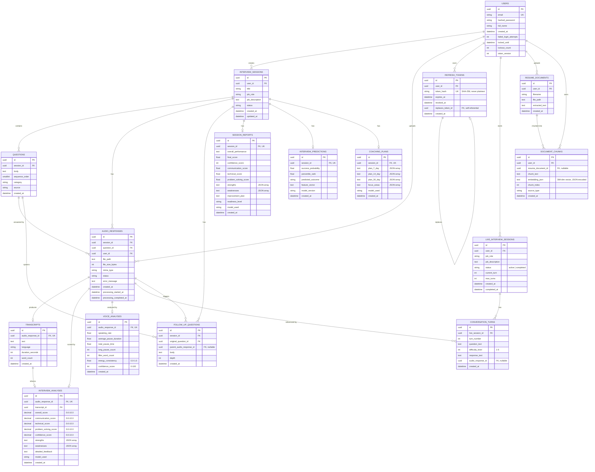

# Database Schema

PostgreSQL 16 in production and Docker Compose; SQLite (in-memory) for the
test suite — both speak through the same SQLAlchemy 2.x models, so no
PostgreSQL-only column types are used. Schema changes are applied via
[Alembic](#migration-history); there is no `Base.metadata.create_all()` path
in the running application.

- **Engine config** (`backend/app/database.py`, PostgreSQL only):
  `pool_size=5`, `max_overflow=10`, `pool_pre_ping=True`, `pool_recycle=3600`.
- **Primary keys**: every table uses a `UUID` primary key (`default=uuid.uuid4`,
  generated in Python, not by the database) — this keeps ID generation
  consistent across PostgreSQL and SQLite and lets the application assign an
  ID before the first `INSERT`.
- **Ownership**: every row that a user can reach traces back to `users.id`,
  directly or via `interview_sessions.user_id` — see
  [SECURITY.md](../SECURITY.md) for how this is enforced (404, not 403, on
  cross-user access).
- **JSON-shaped fields stored as `Text`**: `strengths`, `weaknesses`,
  `plan_7_day`/`plan_14_day`/`plan_30_day`, `focus_areas`, and
  `embedding_json` are JSON-encoded strings in a `Text` column rather than a
  native `JSON`/`JSONB` column, so the same schema works unmodified on
  SQLite in tests.

---

## Entity-Relationship Diagram

---

## Table Reference

| Table | Purpose | Key constraints |
|---|---|---|
| `users` | Account + login-security state | `email` unique |
| `interview_sessions` | A practice interview (job role + description + status) | `status IN (draft, in_progress, processing, completed)` |
| `questions` | Gemini- or manually-generated questions for a session | `UNIQUE(session_id, sequence_order)` |
| `audio_responses` | One uploaded recording answering one question | indexed on `session_id`, `status` |
| `transcripts` | Whisper output for one audio response | `UNIQUE(audio_response_id)` — 1:1 |
| `interview_analyses` | Gemini's 5-dimension score for one response | `UNIQUE(audio_response_id)`; `CHECK` 0.0–10.0 on every score column |
| `voice_analyses` | Librosa acoustic metrics for one response | `UNIQUE(audio_response_id)`; `CHECK` bounds on `confidence_score` (0–100) and `energy_consistency` (0.0–1.0) |
| `follow_up_questions` | AI-generated probing questions chained off a response | indexed on `session_id`, `original_question_id`, `parent_audio_response_id` |
| `session_reports` | Holistic end-of-session report | `UNIQUE(session_id)` — 1:1 |
| `interview_predictions` | Success-probability + percentile from the prediction model | `UNIQUE(session_id)` — 1:1 |
| `coaching_plans` | 7/14/30-day improvement plan | `UNIQUE(session_id)` — 1:1 |
| `refresh_tokens` | Hashed, rotating JWT refresh tokens | `token_hash` unique; self-referential `replaces_token_id` for rotation audit trail |
| `live_interview_sessions` | Multi-turn conversational interview state | `CHECK status IN (active, completed)`; `CHECK 0 <= current_turn <= max_turns` |
| `conversation_turns` | One question/answer turn in a live session | indexed on `audio_response_id` |
| `resume_documents` | An uploaded resume/JD with extracted text | — |
| `document_chunks` | RAG chunks (200-word windows) + embeddings, from a resume or JD | indexed on `resume_document_id` |

## Cascade behavior

- Deleting a **user** cascades to every table above via `ondelete="CASCADE"`
  on the owning foreign key — there is no soft-delete; account deletion is
  destructive and complete.
- Deleting an **interview session** cascades to its `questions`,
  `audio_responses`, `follow_up_questions`, `session_reports`,
  `interview_predictions`, and `coaching_plans`.
- Deleting an **audio response** cascades to its `transcript`,
  `interview_analyses`, and `voice_analyses`, but only `SET NULL`s the
  `audio_response_id` reference on `conversation_turns` and
  `follow_up_questions.parent_audio_response_id` — a live-interview turn or a
  follow-up question survives the deletion of the response that triggered it.
- Deleting a **transcript** `SET NULL`s `interview_analyses.transcript_id`
  rather than cascading — an existing score is not invalidated just because
  its source transcript row is cleaned up.

## Migration history

| Revision | Date | Adds |
|---|---|---|
| `e3d9c8b7a6f5` | 2026-06-07 | `users` |
| `a4f2e9b1c8d7` | 2026-06-07 | `interview_sessions`, `questions` |
| `b5c3f1d2e8a9` | 2026-06-09 | `transcripts`, `interview_analyses` |
| `c7d4e2f1a9b8` | 2026-06-18 | `voice_analyses`, `follow_up_questions`, `session_reports` |
| `d8e5f3a2b1c0` | 2026-06-18 | `live_interview_sessions`, `conversation_turns`, `resume_documents`, `document_chunks`, `interview_predictions`, `coaching_plans` |
| `e9a1c3f5b2d4` | 2026-06-26 | Integrity constraints + indexes (the `CHECK` constraints and indexes listed above) |
| `f1a2b3c4d5e6` | 2026-06-27 | `refresh_tokens`, account-lockout columns on `users` |

Run `alembic upgrade head` to apply all migrations to a fresh database;
see [DEPLOYMENT.md](./DEPLOYMENT.md) for how this runs in CI/CD and
production. `alembic downgrade -1` reverts the most recent revision —
useful locally, not recommended in production without a backup.

## Related documentation

- [API.md](./API.md) — every endpoint that reads/writes these tables.
- [AI_PIPELINE.md](./AI_PIPELINE.md) — how `transcripts`, `interview_analyses`,
  `voice_analyses`, and `document_chunks` get populated.
- [ARCHITECTURE.md](./ARCHITECTURE.md) — system-level request flow.
