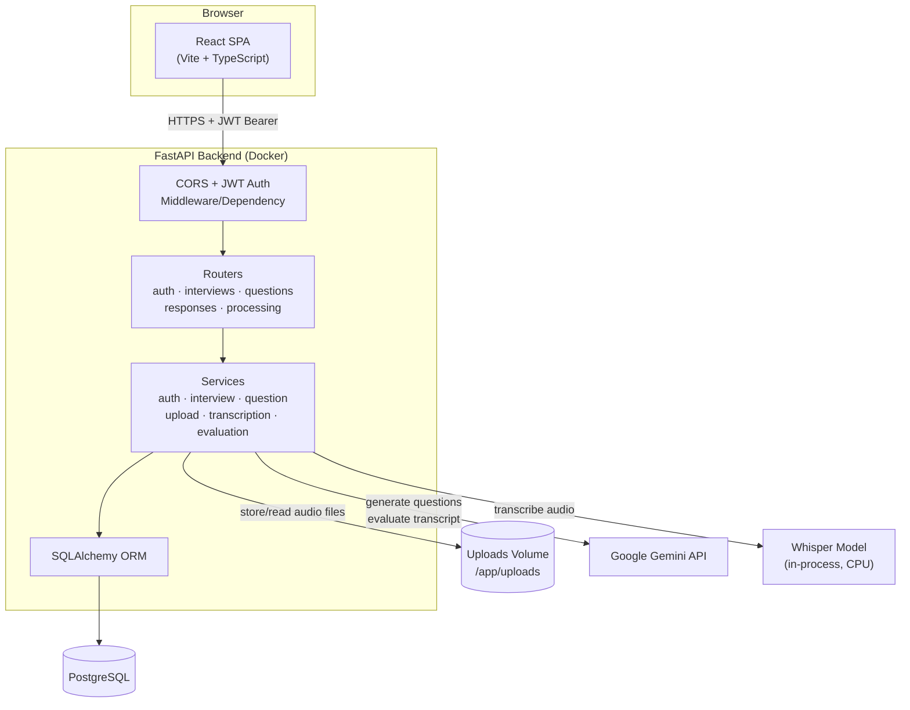
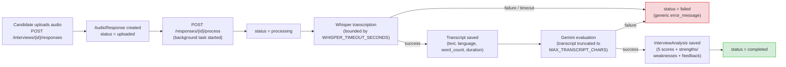
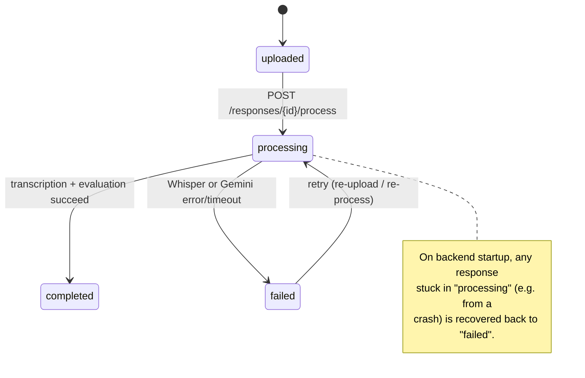

# Architecture

This document expands on the high-level diagram in [README.md](../README.md)
with two views of the system:

1. **Request architecture** — how the frontend, backend, and database fit
   together.
2. **Audio processing pipeline** — what happens to an uploaded recording from
   the moment it's submitted to the moment its transcript and AI analysis are
   available.

---

## 1. Request Architecture

**Key points**

- The SPA never talks to PostgreSQL, Gemini, or Whisper directly — every
  external interaction is mediated by the FastAPI backend.
- `CORS_ORIGINS` and the JWT dependency gate every route except `/health`,
  `/api/v1/auth/register`, and `/api/v1/auth/login`.
- Whisper runs **in-process** as a module-level singleton (one model load per
  backend instance, guarded by a semaphore) — there is no separate ML service.
- Uploaded audio is written to a volume (`docker-compose` bind mount locally,
  a Render Disk in production) so files survive container restarts.

---

## 2. Audio Processing Pipeline

From upload to a finished transcript + AI evaluation:

**Status lifecycle** (`AudioResponse.status`):

**Frontend polling**

The `ResponseCard` component uses `useProcessingStatus`, which polls
`GET /responses/{id}/processing-status` every 3 seconds while
`status` is `uploaded` or `processing`. Polling stops automatically once the
status becomes `completed` or `failed`. On `completed`, the frontend fetches
`GET /responses/{id}/transcript` and `GET /responses/{id}/analysis` and
renders `TranscriptCard` / `AnalysisCard`. On `failed`, only a generic
retry message is shown — the raw `error_message` is never displayed.

---

## Related Documentation

- [DEPLOYMENT.md](./DEPLOYMENT.md) — migration strategy and persistent
  storage rationale.
- [RENDER_DEPLOYMENT.md](./RENDER_DEPLOYMENT.md) — step-by-step Render setup
  that realizes the request architecture above in production.
