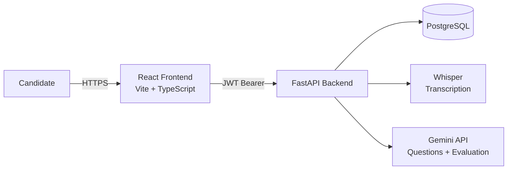

# Portfolio Showcase

A long-form write-up for a personal portfolio site project page. Pairs well
with the screenshots from [screenshots.md](./screenshots.md) and the diagrams
in [architecture.md](./architecture.md).

---

## Project Summary

**AI Interview Intelligence Platform** is a full-stack web application that
helps candidates practice for job interviews. It generates role-specific
interview questions with AI, accepts recorded audio answers, transcribes
them automatically, and returns a structured AI evaluation across five
dimensions with written feedback.

Built with FastAPI, SQLAlchemy, and PostgreSQL on the backend and React with
TypeScript on the frontend, the project covers the full lifecycle of a
production web service: authentication and authorization, an asynchronous
processing pipeline integrating two external AI models, a tested codebase
(108 automated tests), containerization, and a documented cloud deployment.

---

## Problem

Interview preparation is largely unstructured. Candidates rehearse answers
out loud or with a friend, but rarely get consistent, specific feedback on
*how* they answered — was the explanation clear? Did it demonstrate the
right technical depth? Did it actually address the question that was asked?

Generic interview-prep content (question banks, articles) doesn't adapt to a
specific role, and doesn't evaluate the candidate's *own* answers at all.

## Solution

The platform closes that loop:

1. The candidate describes the role they're preparing for (title +
   description).
2. AI (Google Gemini) generates a set of interview questions tailored to
   that role.
3. The candidate records an audio answer to each question.
4. The platform transcribes the answer (OpenAI Whisper) and evaluates it
   (Gemini) across five dimensions — communication, technical depth, problem
   solving, confidence, and overall — returning concrete strengths,
   weaknesses, and detailed feedback.

Everything from question generation through evaluation happens
automatically, so the candidate's loop is simply: *answer, wait, read
feedback, try again*.

---

## Key Features

- **Role-specific AI question generation** — questions are generated from
  the job title and description the candidate provides, not a static bank.
- **Audio response capture** — per-question audio upload with file-size and
  content-type validation.
- **Automatic transcription** — Whisper runs server-side, returning text,
  detected language, word count, and duration.
- **Five-dimension AI evaluation** — communication, technical, problem
  solving, confidence, and overall scores, plus strengths, weaknesses, and
  detailed written feedback.
- **Live processing status** — the UI polls for status and renders results
  the moment they're ready, without a manual refresh.
- **Secure multi-user design** — JWT authentication with per-user ownership
  enforced on every resource; cross-user access returns 404, not 403.
- **Production-shaped deployment** — Dockerized backend, Alembic-managed
  PostgreSQL schema, persistent storage for uploads, and a documented Render
  deployment for both the API and the static frontend.

---

## Architecture



The frontend never talks to PostgreSQL, Whisper, or Gemini directly — every
external interaction goes through the FastAPI backend, which enforces auth,
ownership, and validation before touching any of them.

The audio processing pipeline is modeled as an explicit state machine:

```
uploaded -> processing -> completed
                      \-> failed
```

A background task transcribes the audio (Whisper, with a timeout), then
sends the transcript to Gemini for evaluation (also with a timeout and a
max-length truncation), writing the results and marking the response
`completed`. Any failure — timeout, API error, or a crash mid-job — results
in `failed` with a generic, user-safe message; a startup check recovers any
response stuck in `processing` from a previous crash.

See [architecture.md](./architecture.md) for the full diagrams, including
the request architecture and the status lifecycle state diagram.

---

## Challenges

- **Designing for partial failure.** The "happy path" (upload → transcribe →
  evaluate → done) is the easy 80%. The remaining 20% — Whisper timeouts,
  Gemini API errors, malformed AI responses, server crashes mid-job — needed
  just as much design attention, because a stuck or silently-failed job is
  worse than a clearly-failed one.
- **Authorization at the data layer, not just the route.** It's not enough
  to check "is this user logged in?" — every query needs to be scoped to
  `user_id = current_user.id`. Getting this consistent across sessions,
  questions, responses, transcripts, and analyses (and deciding 404 vs. 403
  for cross-user access) took deliberate, repeatable patterns rather than
  one-off checks.
- **Numeric precision for AI scores.** Gemini returns scores that, if stored
  as raw floats, can pick up IEEE-754 rounding artifacts (e.g. `7.3` becoming
  `7.299999999999999`). Using `NUMERIC(4,1)` columns with Python's `Decimal`
  type (constructed from strings, not floats) avoids this throughout the
  pipeline and the database.
- **Resource constraints for local ML.** Running Whisper in-process means
  the model is loaded once as a singleton and transcriptions are serialized
  with a semaphore — important for keeping memory bounded on a single
  Render instance, but it also meant designing the service (and Docker CMD)
  around a single Uvicorn worker rather than the usual multi-worker default.
- **CORS with credentials.** Because JWT auth uses the `Authorization`
  header (a credentialed request), a wildcard `CORS_ORIGINS` is rejected by
  browsers. The CORS configuration had to support exact-origin allowlisting
  and fail closed (no origins configured = no cross-origin requests allowed)
  rather than silently falling back to `*`.

---

## Lessons Learned

- **State machines make async features tractable.** Once the
  `uploaded/processing/completed/failed` states and their transitions were
  written down explicitly, both the backend logic and the test suite became
  much simpler — every test maps to a transition or a guard against an
  invalid one.
- **"Never expose raw errors" is a design constraint, not an afterthought.**
  Deciding early that the UI would only ever show generic failure messages
  (never raw exception text or API error bodies) simplified error handling
  throughout — every failure path collapses to the same shape.
- **Tests are cheapest when written alongside the feature.** The 94 backend
  tests were written incrementally as each router/service was built, which
  made refactors (e.g. tightening ownership checks) safe — failures pointed
  immediately at the affected endpoint.
- **Deployment documentation surfaces bugs before users do.** Writing the
  step-by-step Render guide required actually tracing through every env var
  and the Alembic pre-deploy step, which caught configuration issues that
  wouldn't have been obvious from the code alone.

---

## Future Roadmap

- **In-browser audio recording** via `MediaRecorder`, removing the
  upload-a-file step entirely.
- **Object storage for audio** (e.g. S3-compatible storage) instead of a
  local/Render Disk, enabling horizontal scaling of the backend.
- **A real job queue** (Celery/RQ or similar) for the processing pipeline,
  replacing in-process background tasks.
- **Emotion/tone signals from audio** (pace, pauses, sentiment) as an
  additional input to the evaluation, alongside the transcript.
- **CI pipeline** running lint, type-check, and the full test suite on every
  push.
- **Session-level summary reports** aggregating scores across all questions
  in a session.

---

## Project Metrics

A quantitative snapshot of the codebase, generated from the repository audit:

| Metric | Count | Notes |
|---|---|---|
| **REST API endpoints** | 17 (+ `/health`) | Across 5 routers: auth, interviews, questions, responses, processing |
| **Database tables** | 6 | `users`, `interview_sessions`, `questions`, `audio_responses`, `transcripts`, `interview_analyses` |
| **Database migrations** | 3 | Alembic-managed, applied via a pre-deploy command in production |
| **Automated tests** | 108 | 94 backend (pytest, across 9 test files) + 14 frontend (Vitest + React Testing Library, across 3 test files) |
| **Frontend components & pages** | 11 | 7 reusable components (`Layout`, `SessionCard`, `QuestionCard`, `ResponseCard`, `ProcessingStatusCard`, `TranscriptCard`, `AnalysisCard`) + 4 routed pages (`LoginPage`, `RegisterPage`, `SessionsListPage`, `SessionDetailPage`) |
| **AI evaluation dimensions** | 5 | Communication, technical, problem solving, confidence, overall |
| **External AI services integrated** | 2 | Google Gemini (questions + evaluation), OpenAI Whisper (transcription) |
| **Core technologies** | 16+ | FastAPI, SQLAlchemy, Alembic, Pydantic, python-jose, bcrypt, PostgreSQL, Google Gemini, OpenAI Whisper, PyTorch, React, TypeScript, Vite, React Router, Docker, Render |
